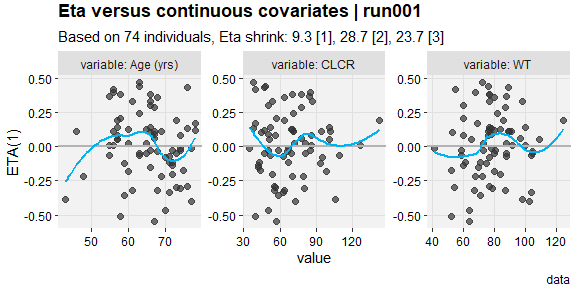

<!-- README.md is generated from README.Rmd. Please edit that file -->

# xpose.xtras 

<!-- badges: start -->
<!-- badges: end -->

## Introduction

This package adds some extra functionality and plots to the **xpose**
framework. This includes some plots that have been missing in
translation from **xpose4**, but also some useful features that truly
extend the capabilities of what can be done with **xpose**.

There are a few bugfixes here and functionality which could easily be
suggested as pull requests to the parent package. Given the size and
broad use of **xpose**, it appears even minor pull requests take some
time to implement. As such, this package implements those features
directly and if at any point in the future these are added (perhaps in a
better state) to the parent package, they will be deprecated if this
package is in active use. For those wondering, **conflicted** is used to
manage bugfix conflicts, so users should be comfortable loading packages
in any order.

## Installation

This package is currently only available here, but submission to CRAN is
planned.

The typical github installation will work. At time of writing, this is a
private repo, so access to this organization and proper token credential
are required.

``` r
devtools::install_github("pfizer-rd/xpose.xtras")
```

## Preview

The grandparent package, **xpose4**, has a lovely collection of figures
and documentation that is referred to as a “bestiary”. The **pkgdown**
site for this package serves as a complete bestiary, but see the
uncommented examples below as a sort of menagerie. There is no
assumption that these examples are self-explanatory, but hopefully users
familiar with **xpose** will recognize the new (and *re*newed) tools
made available by this package.

``` r
described <- xpdb_x %>%
  set_var_labels(AGE="Age", MED1 = "Digoxin", .problem = 1) %>%
  set_var_units(AGE="yrs")  %>%
  set_var_levels(SEX=lvl_sex(), MED1 = lvl_bin())
eta_vs_contcov(described,etavar=ETA1, quiet=TRUE)
#> `geom_smooth()` using formula = 'y ~ x'
#> `geom_smooth()` using formula = 'y ~ x'
```



``` r
eta_vs_catcov(described,etavar=ETA1, quiet=TRUE)
```


``` r
pheno_set %>%
  focus_qapply(backfill_iofv) %>%
  dofv_vs_id(run6, run9, quiet = TRUE)
```


``` r
pkpd_m3 %>%
  set_var_types(catdv=BLQ,dvprobs=LIKE) %>%
  set_dv_probs(1, 1~LIKE, .dv_var = BLQ) %>%
  set_var_levels(1, BLQ = lvl_bin()) %>%
  catdv_vs_dvprobs(quiet=TRUE)
#> `geom_smooth()` using method = 'gam' and formula = 'y ~ s(x, bs = "cs")'
#> `geom_smooth()` using method = 'gam' and formula = 'y ~ s(x, bs = "cs")'
```


