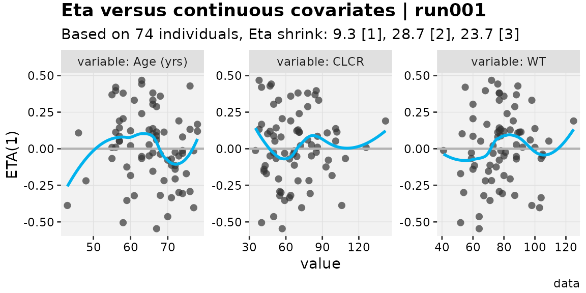
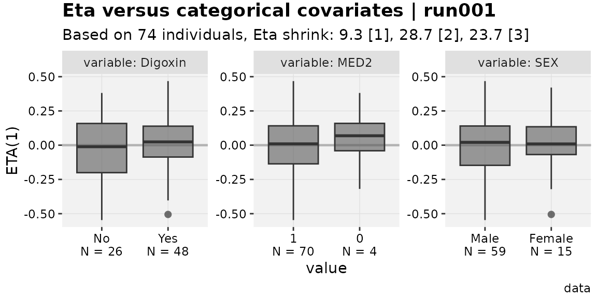
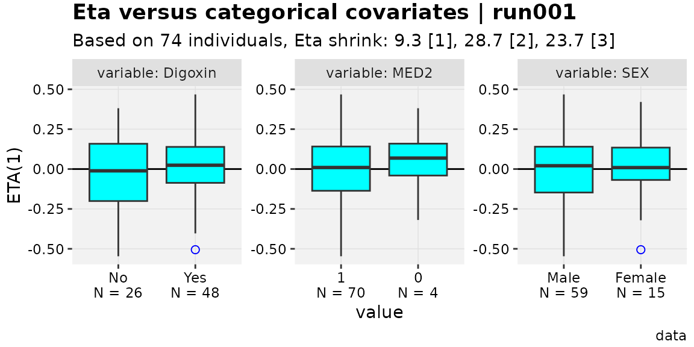

# The extended xpose data object

## How to get the object

The `xpose_data` object (aka: `xpdb`) gets a few extensions in this
package. Many of these are added to accommodate new plots and features,
but in most cases these features are cross-compatible with a typical
`xpose_data` object as well. The extended version of `xpose_data` has
the class `xp_xtra`, and is also referred to as `xpdb_x`.

Conversion of an `xpose_data` object is simple.

``` r
xpdb_converted <- xpdb_ex_pk %>%
  as_xpdb_x()

# To verify:
xpdb_ex_pk
#> run001.lst overview: 
#>  - Software: nonmem 7.3.0 
#>  - Attached files (memory usage 1.4 Mb): 
#>    + obs tabs: $prob no.1: catab001.csv, cotab001, patab001, sdtab001 
#>    + sim tabs: $prob no.2: simtab001.zip 
#>    + output files: run001.cor, run001.cov, run001.ext, run001.grd, run001.phi, run001.shk 
#>    + special: <none> 
#>  - gg_theme: theme_readable 
#>  - xp_theme: theme_xp_default 
#>  - Options: dir = data, quiet = FALSE, manual_import = NULL
xpdb_converted
#> 
#> ── ~ xp_xtras object 
#> Model description: NONMEM PK example for xpose
#> run001.lst overview: 
#>  - Software: nonmem 7.3.0 
#>  - Attached files (memory usage 1.5 Mb): 
#>    + obs tabs: $prob no.1: catab001.csv, cotab001, patab001, sdtab001 
#>    + sim tabs: $prob no.2: simtab001.zip 
#>    + output files: run001.cor, run001.cov, run001.ext, run001.grd, run001.phi, run001.shk 
#>    + special: <none> 
#>  - gg_theme: theme_readable 
#>  - xp_theme: xp_xtra_theme new_x$xp_theme 
#>  - Options: dir = data, quiet = FALSE, manual_import = NULL, cvtype = exact
```

As shown, there are some minor changes to the output for
[`print()`](https://rdrr.io/r/base/print.html) to help confirm if an
object is the extended version. However, this is implemented merely as
an S3 class, so all `xpose` functions will continue to work with this
new object; the current package is also written in a way to work even if
the `xp_xtra` object loses that class.

Notably, there is no convenience function to read a model output
directly to an `xp_xtra` object, so all objects labelled as `xp_xtra`
start as `xpose_data`.

Many example `xp_xtra` objects are included in this package, covering a
variety of special cases.

## What features are available?

### Tidying up

It is by design that `xpose` attempts to align well with the `tidyverse`
family of R packages, so one focus of the extension package is to make
that alignment a bit more consistent. For example,
[`xpose::set_var_types`](https://uupharmacometrics.github.io/xpose/reference/set_vars.html)
accepts character vectors of column names, but not tidyselection. As
such, columns named in a consistent and tidyselect-friendly way cannot
be used to an advantage. A minimal example can be seen below, but of
course there are more complex situations where this is convenient.

``` r
# Unset all example covariates
xpdb_ex_covs <- xp_var(xpdb_ex_pk, type = c("catcov","contcov"), .problem=1) %>% 
  pull(col)
xpdb_ex_covs
#> [1] "MED1" "MED2" "SEX"  "AGE"  "CLCR" "WT"
no_covs <- set_var_types(xpdb_ex_pk, .problem=1, na = xpdb_ex_covs)

# set_var_types on xpose_data objects uses xpose::set_var_types
set_var_types(no_covs, .problem=1, catcov = c("MED1","MED2")) %>%
  xp_var(type = c("catcov"), .problem=1) %>% 
  pull(col)
#> [1] "MED1" "MED2"
no_covs %>%
  as_xpdb_x() %>%
  set_var_types(catcov = starts_with("MED"), .problem=1) %>%
  xp_var(type = c("catcov"), .problem=1) %>% 
  pull(col)
#> [1] "MED1" "MED2"
```

Tidyselection is used fairly heavily in the `xpose.xtras` package where
it seems intuitive to include it. There are likely functions that could
use it but do not currently. As such, the documentation does attempt to
distinguish where `tidyselect` is expected.

### Labels, units and (also) levels

Another feature includes a few visual confirmations of variable units,
labels and (new to this package) levels. In `xpose`, users are able to
add units and labels to any variable, which are stored in the object and
are theoretically used somewhere. This package attempts to use these
communication features more liberally in plots and for the user, but
broader implementation (some of which require changes to existing
`xpose` functions) is not complete just yet.

With labels and units, these are applied using the conventional `xpose`
functions. However, unlike in `xpose`, these can be confirmed using
[`list_vars()`](https://jprybylski.github.io/xpose.xtras/reference/list_vars.md)
in `xpose.xtras`.

``` r
w_unit_labs <- xpdb_x %>%
  set_var_labels(AGE="Age", MED1 = "Digoxin", .problem = 1) %>%
  set_var_units(AGE="yrs")
list_vars(w_unit_labs, .problem = 1)
#> List of available variables for problem no. 1
#>  - Subject identifier (id)               : ID
#>  - Dependent variable (dv)               : DV
#>  - Independent variable (idv)            : TIME
#>  - Time after dose (tad) (tad)           : TAD
#>  - Dose amount (amt)                     : AMT
#>  - Event identifier (evid)               : EVID
#>  - Model typical predictions (pred)      : PRED
#>  - Model individual predictions (ipred)  : IPRED
#>  - Model parameter (param)               : KA, CL, V, ALAG1
#>  - Eta (eta)                             : ETA1, ETA2, ETA3
#>  - Residuals (res)                       : CWRES, IWRES, RES, WRES
#>  - Categorical covariates (catcov)       : SEX [0], MED1 ('Digoxin') [0], MED2 [0]
#>  - Continuous covariates (contcov)       : CLCR, AGE ('Age', yrs), WT
#>  - Compartment amounts (a)               : A1, A2
#>  - Not attributed (na)                   : DOSE, SS, II, CPRED
```

Levels can also be added to any variable, but can be especially useful
for categorical covariates (`catcov`) and categorical DVs (type `catdv`,
added by this package). The documentation for
[`set_var_levels()`](https://jprybylski.github.io/xpose.xtras/reference/set_var_levels.md)
can be referenced for more information about this, but the example below
shows how this feature can be used and checked.

``` r
w_levels <- w_unit_labs  %>%
  set_var_levels(SEX=lvl_sex(), MED1 = lvl_bin())
list_vars(w_levels, .problem = 1)
#> List of available variables for problem no. 1
#>  - Subject identifier (id)               : ID
#>  - Dependent variable (dv)               : DV
#>  - Independent variable (idv)            : TIME
#>  - Time after dose (tad) (tad)           : TAD
#>  - Dose amount (amt)                     : AMT
#>  - Event identifier (evid)               : EVID
#>  - Model typical predictions (pred)      : PRED
#>  - Model individual predictions (ipred)  : IPRED
#>  - Model parameter (param)               : KA, CL, V, ALAG1
#>  - Eta (eta)                             : ETA1, ETA2, ETA3
#>  - Residuals (res)                       : CWRES, IWRES, RES, WRES
#>  - Categorical covariates (catcov)       : SEX [2], MED1 ('Digoxin') [2], MED2 [0]
#>  - Continuous covariates (contcov)       : CLCR, AGE ('Age', yrs), WT
#>  - Compartment amounts (a)               : A1, A2
#>  - Not attributed (na)                   : DOSE, SS, II, CPRED
```

Labels, units and levels also appear in new plotting functions. There
are some more complex functions where this renaming has not been
implemented, but the plan is to have it be universal eventually.

``` r
eta_vs_contcov(w_unit_labs,etavar=ETA1, quiet=TRUE)
#> `geom_smooth()` using formula = 'y ~ x'
```



``` r
eta_vs_catcov(w_levels,etavar=ETA1, quiet=TRUE)
```



Note in the categorical plots, the number of individuals represented by
each category is underneath the value. This is similar to the
presentation in the package
[`pmplots`](https://metrumresearchgroup.github.io/pmplots/), but uses
the existing `xpose` framework. This option requires the use of an
`xp_xtra` object, and can be disabled with the argument `show_n=FALSE`.

### Parameter tables

The
[`get_prm()`](https://jprybylski.github.io/xpose.xtras/reference/get_prm.md)
function in `xpose` has been extended to output coefficient of variation
percent (CV%) for $\omega^{2}$ parameters and shrinkages where relevant.

``` r
get_prm(pheno_final) %>%
  select(-c(fixed,m,n))
#> Returning parameter estimates from $prob no.1, subprob no.1, method foce
#> # A tibble: 7 × 9
#>   type  name       label       value         se      rse diagonal      cv    shk
#>   <chr> <chr>      <chr>     <num:4>    <num:4>  <num:4> <lgl>    <num:4> <num:>
#> 1 the   THETA1     "CLpkg"  0.004813  0.0002365  0.04914 NA         NA      NA  
#> 2 the   THETA2     "Vpkg"   0.9964    0.02642    0.02652 NA         NA      NA  
#> 3 the   THETA3     "RUVADD" 2.784     0.2513     0.09027 NA         NA      NA  
#> 4 ome   OMEGA(1,1) "IIVCL"  0.2009    0.05108    0.2543  TRUE       20.30   20.1
#> 5 ome   OMEGA(2,1) ""       0.7236    0.2654     0.3668  FALSE      NA      NA  
#> 6 ome   OMEGA(2,2) "IIVV"   0.1576    0.02614    0.1659  TRUE       15.86   11.6
#> 7 sig   SIGMA(1,1) ""       1        NA         NA       TRUE       NA      19.6
```

There are a few options to change CV% where an opinion might conflict
with the default. One such option is to add a description of how the
parameter is used, which results in an exact CV% determined through
integration to be used. For example, if variability on the
weight-normalized clearance and volume of distribution parameters in one
of the example models was logit-normally distributed, it could be
described as follows.

``` r
pheno_final %>%
   add_prm_association(CLpkg~logit(IIVCL),Vpkg~logit(IIVV)) %>%
   get_prm() %>%
  select(-c(fixed,m,n))
#> Returning parameter estimates from $prob no.1, subprob no.1, method foce
#> # A tibble: 7 × 9
#>   type  name       label       value         se      rse diagonal       cv   shk
#>   <chr> <chr>      <chr>     <num:4>    <num:4>  <num:4> <lgl>     <num:4> <num>
#> 1 the   THETA1     "CLpkg"  0.004813  0.0002365  0.04914 NA       NA        NA  
#> 2 the   THETA2     "Vpkg"   0.9964    0.02642    0.02652 NA       NA        NA  
#> 3 the   THETA3     "RUVADD" 2.784     0.2513     0.09027 NA       NA        NA  
#> 4 ome   OMEGA(1,1) "IIVCL"  0.2009    0.05108    0.2543  TRUE     20.19     20.1
#> 5 ome   OMEGA(2,1) ""       0.7236    0.2654     0.3668  FALSE    NA        NA  
#> 6 ome   OMEGA(2,2) "IIVV"   0.1576    0.02614    0.1659  TRUE      0.05778  11.6
#> 7 sig   SIGMA(1,1) ""       1        NA         NA       TRUE     NA        19.6
#> # Parameter table includes the following associations: CLpkg~logit(IIVCL) and
#> Vpkg~logit(IIVV)
```

There is a fair amount of complexity in the
[`get_prm()`](https://jprybylski.github.io/xpose.xtras/reference/get_prm.md)
extensions, including ability to change parameter value while also
changing standard error and relevant variance-covariance (in position
for the `.cov` and `.cor` files). See
[`?add_prm_association`](https://jprybylski.github.io/xpose.xtras/reference/add_prm_association.md)
and
[`?mutate_prm`](https://jprybylski.github.io/xpose.xtras/reference/mutate_prm.md).

## Cross-compatibility

In various warning messages, the `xp_xtras` object is referred to as
“cross-compatible”. This word choice is intended to highlight that many
functions developed for `xp_xtras` objects will still work (perhaps with
some diminished functionality) for `xpose_data` objects, and that the
inverse is of course true.

Another way this cross-compatibility is maintained is via custom themes.
There may be `xpose` users concerned about adopting `xpose.xtras`
because with the new plot elements they would have to declare new
aesthetic defaults. Conveniently, the `xp_xtra` theme is derived in a
way such that aesthetics for defined plot elements are re-used for
similar new elements, meaning there is less (if any) updates needed to
use a custom theme beyond using something like the following.

``` r
favorite_theme <- xpose::theme_xp_xpose4() # stand-in for "custom" theme

eta_vs_catcov(w_levels,etavar=ETA1, quiet=TRUE)
```


``` r
eta_vs_catcov(w_levels,etavar=ETA1, quiet=TRUE, xp_theme = favorite_theme)
```



Note that worked even though `boxplot_fill` is not defined in the
[`xpose::theme_xp_xpose4()`](https://uupharmacometrics.github.io/xpose/reference/xp_themes.html).
To update an existing theme object to one for the extension package
(instead of using the old theme in the `xp_theme` argument), simply use
`updated_theme <- xp_xtra_theme(old_theme)`.

## Convenience

`xpose` has a collection of getter and setter functions to interact with
parts of an `xpose_data` object, but these tend to be lower level and
not exported. To add this convenience and make it user-friendly, a few
functions have been added.

Properties from a model summary can now be pulled without using
[`xpose::get_summary()`](https://uupharmacometrics.github.io/xpose/reference/get_summary.html).

``` r
pheno_final %>% get_shk()
#> [1] 20.1 11.6
pheno_final %>% get_shk("eps")
#> [1] 19.6
pheno_final %>% get_prop("ofv")
#> [1] "587.918"
pheno_final %>% get_prop("descr")
#> [1] "na"
```

`xpose` has certain expectations around how model descriptions are
included in model code. At time of writing, it is expected the format is
something like “; 2. Description: (text)”. To add some flexibility,
users can either use
[`set_prop()`](https://jprybylski.github.io/xpose.xtras/reference/set_prop.md)
to change description directly, or pull it from a more generic scan of
the model code comments using
[`desc_from_comments()`](https://jprybylski.github.io/xpose.xtras/reference/desc_from_comments.md).

``` r
pheno_final %>% desc_from_comments() %>% get_prop("descr")
#> [1] "Reparameterized final model"
```

It can be helpful to add information to the model data that is available
elsewhere in the `xpose_data` object, such as individual objective
functions. Currently, those can be added using
[`backfill_iofv()`](https://jprybylski.github.io/xpose.xtras/reference/backfill_iofv.md),
which is most often used in the context of `xpose_set` objects.
Theoretically more backfill functions can be made available.
