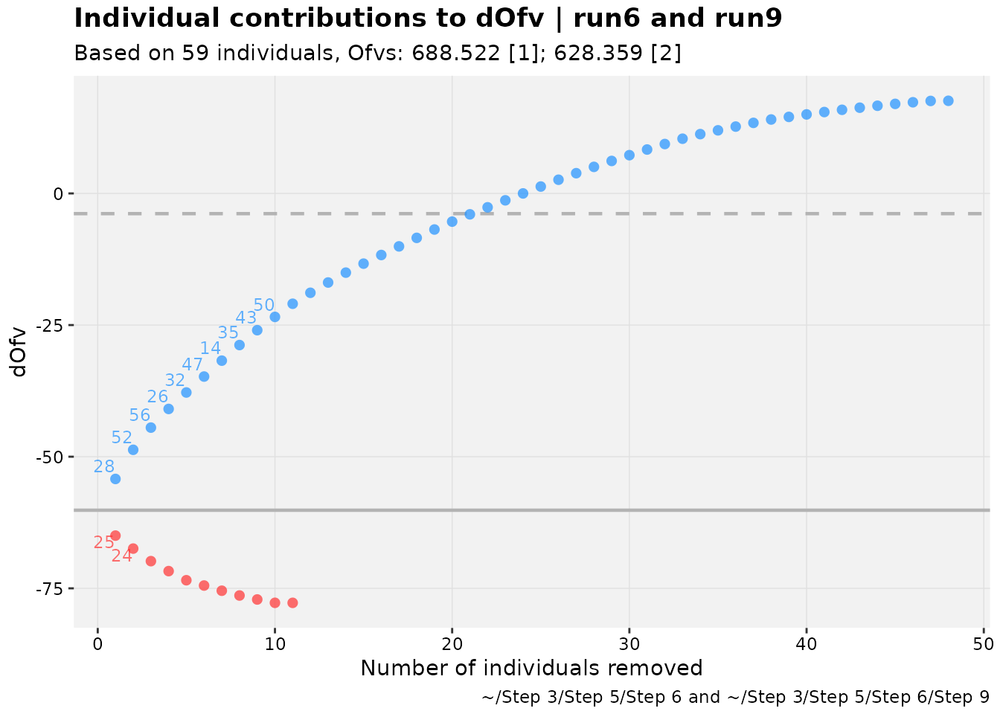

# Using xpose sets

## Introduction

A powerful new object building upon the `xpose` framework is the
`xpose_set`. Much like how `xpose_data` is in essence a list of
information and data about the fitted model, `xpose_set` is a list of
`xpose_data` (or `xp_xtras`) objects with information about how these
models relate to one another.

Creating a set is easy. An important point to remember about usage is
that each set item must have a label. Depending on how the set is
created, the default is to use the name of the `xpose_data` object, but
if an unnamed list is spliced or any objects share the same label, an
error will occur. Note, however, that duplicate `xpose_data` objects can
be used, as long as they have different labels. In the
[`xpose_set()`](https://jprybylski.github.io/xpose.xtras/reference/xpose_set.md)
example below, three example models fitting the same dataset are made
into a set, and alternative labels are used for one version of the set.

``` r
xpose_set(pheno_base, pheno_final, pheno_saem)
#> 
#> ── xpose_set object ────────────────────────────────────────────────────────────
#> • Number of models: 3
#> • Model labels: pheno_base, pheno_final, and pheno_saem
#> • Number of relationships: 0
#> • Focused xpdb objects: none
#> • Exposed properties: none
#> • Base model: none
xpose_set(base=pheno_base, reparam=pheno_final, reparam_saem=pheno_saem)
#> 
#> ── xpose_set object ────────────────────────────────────────────────────────────
#> • Number of models: 3
#> • Model labels: base, reparam, and reparam_saem
#> • Number of relationships: 0
#> • Focused xpdb objects: none
#> • Exposed properties: none
#> • Base model: none
```

The `print` output hints at features that will be explored in this
vignette. A few example sets are in the package that can be used to test
some of the elements discussed here. A relatively complex example
explores typical model-building steps for the common phenobarbital in
neonates dataset, called `pheno_set`, diagrammed below.

``` r
diagram_lineage(pheno_set) %>%
  DiagrammeR::render_graph(layout="tree")
```

## Relationships

Relationships between models in a set can be declared with formula
notation, where one or more child models is dependent on one or more
parents (`child1+... ~ parent1+...`). To demonstrate, parts of
`pheno_set` can be reproduced.

``` r
phrun3 <- pheno_set$run3$xpdb
phrun5 <- pheno_set$run5$xpdb
phrun6 <- pheno_set$run6$xpdb
phrun7 <- pheno_set$run7$xpdb
phrun8 <- pheno_set$run8$xpdb
phrun9 <- pheno_set$run9$xpdb
pheno_stem <- xpose_set(phrun3,phrun5,phrun6, .as_ordered = TRUE)
pheno_stem
#> 
#> ── xpose_set object ────────────────────────────────────────────────────────────
#> • Number of models: 3
#> • Model labels: phrun3, phrun5, and phrun6
#> • Number of relationships: 2
#> • Focused xpdb objects: none
#> • Exposed properties: none
#> • Base model: none
diagram_lineage(pheno_stem) %>%
  DiagrammeR::render_graph(layout="tree")
```

``` r
pheno_branch <- xpose_set(phrun6,phrun7,phrun8,phrun9, .relationships = c(phrun7+phrun8+phrun9~phrun6))
pheno_branch
#> 
#> ── xpose_set object ────────────────────────────────────────────────────────────
#> • Number of models: 4
#> • Model labels: phrun6, phrun7, phrun8, and phrun9
#> • Number of relationships: 3
#> • Focused xpdb objects: none
#> • Exposed properties: none
#> • Base model: none
diagram_lineage(pheno_branch) %>%
  DiagrammeR::render_graph(layout="tree")
```

Trees can also be concatenated, using typical R/tidyverse syntax.

``` r
pheno_tree <- pheno_stem %>% 
  # drop phrun6 from stem
  select(-phrun6) %>%
  c(
    pheno_branch,
    .relationships = c(phrun6~phrun5)
  )
pheno_tree
#> 
#> ── xpose_set object ────────────────────────────────────────────────────────────
#> • Number of models: 6
#> • Model labels (truncated): phrun3, phrun5, phrun6, phrun7, and phrun8 (...)
#> • Number of relationships: 5
#> • Focused xpdb objects: none
#> • Exposed properties: none
#> • Base model: none
#> # ℹ 1 more xpdbs
#> # ℹ Use `print(n = ...)` to see more than n = 5
diagram_lineage(pheno_tree) %>%
  DiagrammeR::render_graph(layout="tree")
```

The documentation for
[`?add_relationship`](https://jprybylski.github.io/xpose.xtras/reference/add_relationship.md)
contains more information about declaring and removing relationships.
Users should be aware that model lineage is actually used by some
functions that process `xpose_set` objects to generate output, so
declaring parentage should be done only when it is valid. This does not
mean necessarily that the child should be nested in the parent(s), but
lineage is considered relevant in functions that compare models.

## Comparing models in sets

Models in a set can be compared with a few functions and plots. The
functions for comparison include a
[`diff()`](https://rdrr.io/r/base/diff.html) method.

``` r
diff(pheno_set)
#> [1] -148.723  -37.080  -60.163  -43.281   35.133
```

The method above limits the comparison to the longest lineage in the
provided set, starting at a base model if one is declared. The models
included can be examined by probing with the
[`xset_lineage()`](https://jprybylski.github.io/xpose.xtras/reference/xset_lineage.md)
function.

``` r
tbl_diff <- function(set) tibble(
  models = xset_lineage(set),
  diff = c(0,diff(set))
)
tbl_diff(pheno_set)
#> # A tibble: 6 × 2
#>   models   diff
#>   <chr>   <dbl>
#> 1 run3      0  
#> 2 run5   -149. 
#> 3 run6    -37.1
#> 4 run9    -60.2
#> 5 run14   -43.3
#> 6 run15    35.1
pheno_set %>%
  remove_relationship(run9~run6) %>%
  tbl_diff()
#> # A tibble: 5 × 2
#>   models      diff
#>   <chr>      <dbl>
#> 1 run3      0     
#> 2 run5   -149.    
#> 3 run6    -37.1   
#> 4 run10    -0.0230
#> 5 run12    -0.181
pheno_set %>%
  set_base_model(run6) %>%
  tbl_diff()
#> # A tibble: 4 × 2
#>   models  diff
#>   <chr>  <dbl>
#> 1 run6     0  
#> 2 run9   -60.2
#> 3 run14  -43.3
#> 4 run15   35.1
tibble(
  models = xset_lineage(pheno_set,run6),
  diff = c(0,diff(pheno_set,run6))
)
#> # A tibble: 4 × 2
#>   models  diff
#>   <chr>  <dbl>
#> 1 run6     0  
#> 2 run9   -60.2
#> 3 run14  -43.3
#> 4 run15   35.1
```

[`xset_lineage()`](https://jprybylski.github.io/xpose.xtras/reference/xset_lineage.md)
and [`diff()`](https://rdrr.io/r/base/diff.html) can also generate lists
if multiple models are passed to `...`, which treats those as base
models.

``` r
diff(pheno_set, run10,run9)
#> $run10
#> [1] -0.181
#> 
#> $run9
#> [1] -43.281  35.133
xset_lineage(pheno_set, run10,run9)
#> $run10
#> [1] "run10" "run12"
#> 
#> $run9
#> [1] "run9"  "run14" "run15"
```

Models can also be compared through various plots. Many that use
individual objective function values (iOFVs) require these values to be
in the `xpdb` data. If these are missing and the `xpose_data` object is
generated based on a NONMEM run, these can be added with the
[`backfill_iofv()`](https://jprybylski.github.io/xpose.xtras/reference/backfill_iofv.md)
function. We discuss focusing in another section, but it is useful here,

Two models can be compared one way using an updated version of a
`xpose4` function; this is referred to in some places as a “shark plot”,
and it is called `xpose4::dOFV.vs.id()` in `xpose4`. As such, it is
called
[`shark_plot()`](https://jprybylski.github.io/xpose.xtras/reference/shark_plot.md)
or
[`dofv_vs_id()`](https://jprybylski.github.io/xpose.xtras/reference/shark_plot.md)
in `xpose.xtras`.

``` r
pheno_set %>%
  focus_qapply(backfill_iofv) %>%
  shark_plot(run6, run9, quiet = TRUE)
```



There are also functions to use an `xpose_set` for model-averaging and
other ways to visually explore the impact of model changes on individual
fits which are all documented within the package. Many of these are
considered experimental, but all facilitate further improvements.

## Manipulating a set

We have already explored a few ways to manipulate a set. These
manipulations are distinctly designed so that a user can change the
overall set or `xpose_data` elements within the set using fairly
intuitive functionality.

Information from `xpose_data` summary or parameter values can be
“exposed”, which means they become associated with the set item on the
top level. To view these as a table, the function
[`reshape_set()`](https://jprybylski.github.io/xpose.xtras/reference/reshape_set.md)
can be used. Note the exposed data are denoted by the prefix `..` (two
dots) in their column names.

``` r
pheno_set %>%
  expose_property(ofv) %>%
  expose_param(ome1) %>%
  reshape_set() %>%
  head()
#> # A tibble: 6 × 7
#>   xpdb         label parent       base  focus ..ofv ..ome1
#>   <named list> <chr> <named list> <lgl> <lgl> <dbl>  <dbl>
#> 1 <xp_xtras>   run3  <chr [1]>    FALSE FALSE  874.  1.69 
#> 2 <xp_xtras>   run4  <chr [1]>    FALSE FALSE  834.  0.608
#> 3 <xp_xtras>   run5  <chr [1]>    FALSE FALSE  726.  0.198
#> 4 <xp_xtras>   run6  <chr [1]>    FALSE FALSE  689.  0.239
#> 5 <xp_xtras>   run10 <chr [1]>    FALSE FALSE  688.  0.243
#> 6 <xp_xtras>   run12 <chr [1]>    FALSE FALSE  688.  0.232
```

There are methods for the popular `dplyr` verbs which attempt to produce
the expected results despite the underlying structure of an `xpose_set`
not being tabular.

``` r
pheno_set %>%
  select(run3,run15) %>%
  names()
#> [1] "run3"  "run15"
pheno_set %>%
  # Note renaming can affect parentage.
  # For simplicity, this method does not change 
  # parent automatically in child
  rename(NewName = run3) %>%
  names()
#>  [1] "NewName" "run4"    "run5"    "run6"    "run10"   "run12"   "run11"  
#>  [8] "run13"   "run7"    "run8"    "run9"    "run14"   "run15"   "run16"
pheno_set %>%
  expose_property(ofv) %>%
  filter(..ofv < 700) %>%
  names()
#>  [1] "run6"  "run10" "run12" "run11" "run13" "run7"  "run8"  "run9"  "run14"
#> [10] "run15" "run16"
pheno_set %>%
  expose_param(ome1) %>%
  pull(..ome1)
#>  [1] 1.69000 0.60800 0.19800 0.23900 0.24270 0.23200 0.23700 0.22800 0.25400
#> [10] 0.03432 0.17600 0.03870 0.03470 0.04037
```

These verbs are also defined for `xpose_data` objects, and it may be
desired to “forward” the function to the `xpose_data` objects in a set
instead of applying them to the set object. That functionality is
available through focusing. Focused elements in the set automatically
forward functions to the `xpose_data` objects in the element, and do
nothing to unfocused elements.

``` r
focus_test <- pheno_set %>%
  focus_xpdb(run3,run15) %>%
  mutate(test_col = 1) %>%
  unfocus_xpdb()
tail(names(get_data(focus_test$run6$xpdb, quiet=TRUE)))
#> [1] "CWRES" "NPDE"  "DV"    "PRED"  "RES"   "WRES"
tail(names(get_data(focus_test$run3$xpdb, quiet=TRUE)))
#> [1] "NPDE"     "DV"       "PRED"     "RES"      "WRES"     "test_col"
```

Any function can be passed to focused `xpose_data` objects with
[`focus_function()`](https://jprybylski.github.io/xpose.xtras/reference/focus_xpdb.md).
A shortcut for focusing everything, applying a function and unfocusing
everything is available in the form of
[`focus_qapply()`](https://jprybylski.github.io/xpose.xtras/reference/focus_xpdb.md).
