# Useful uncommon plots

## Introduction

The `xpose.xtras` package attempts to bring old favorites back to the
`xpose` framework from its predecessor `xpose4`, and those are named as
such to allow easy access to documentation. This vignette brings focus
to the visualizations in this package that are unlikely to be used for
most projects, but are still helpful to have when they are needed. The
underlying tools built for these functions are also powerful and
supportive of greater extension of the `xpose` framework.

## Model-averaged plots

Model-averaging can be useful when two or more models can describe
different aspects of the data or the pharmacology, but for various
reasons a mixture model or other population approach would be
inadequate. It can also be helpful when multiple models have been
developed for various populations and a new population being fit does
not necessarily consist entirely of any previously fitted population.

This package facilitates the generation of model-averaged diagnostics.
The approach is rudimentary and experimental, merely creating an
averaged version of an `xpose_data` object from an `xpose_set`. As
referenced in the documentation, the Model Selection and Model Averaged
Algorithms used by Uster et al. are implemented to do this averaging
([`?modavg_xpdb`](https://jprybylski.github.io/xpose.xtras/reference/modavg_xpdb.md)).
Because both algorithms require individual objective functions, there is
an argument to automatically apply
[`backfill_iofv()`](https://jprybylski.github.io/xpose.xtras/reference/backfill_iofv.md).

``` r
pheno_set %>%
  ipred_vs_idv_modavg(auto_backfill = TRUE, quiet=TRUE)
#> `geom_smooth()` using formula = 'y ~ x'
```

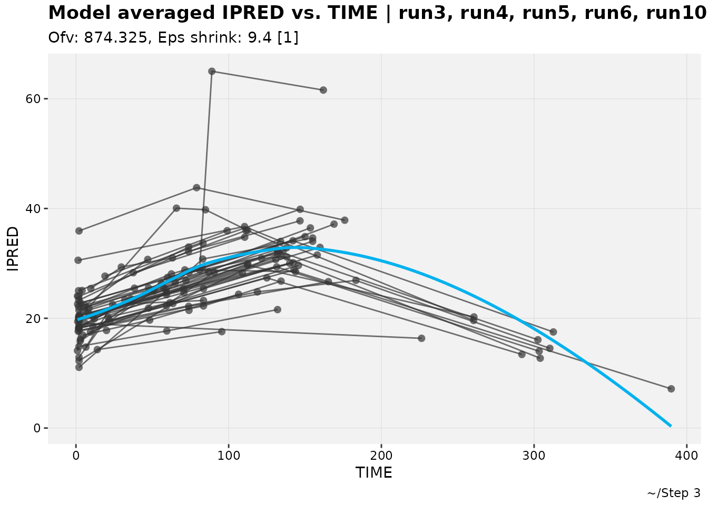

The default title, subtitle and caption for these experimental figures
are rough, especially for large sets. Changes for better appearance
should be expected in the future.

While a simple demonstration is not presented here, most plots can also
be model-averaged using the generic
[`plotfun_modavg()`](https://jprybylski.github.io/xpose.xtras/reference/modavg_plots.md)
function.

## Categorical dependent variables

Categorical DVs are frequently modeled but there are a variety of
methods used to visually diagnose these modeled endpoints, typically
model-specific. Along with adding generic support for categorical DVs,
`xpose.xtras` also adds a few plots to diagnose models developed for
them.

To use these diagnostics, a model for a categorical DV needs to have the
column for that DV stated (if it is “DV” that needs to be ripped away
from the `dv` variable type), and have a column predicting the
likelihood or probability of that DV having a certain value. An example
using an M3 model is below and in the documentation.

``` r
described_pkpd_m3 <- pkpd_m3 %>%
  # Need to ensure var types are set
  set_var_types(catdv=BLQ,dvprobs=LIKE) %>%
  # Set probs ("LIKE is the probability tht BLQ is 1")
  set_dv_probs(1, 1~LIKE, .dv_var = BLQ) %>%
  # Optional, but useful to set levels
  set_var_levels(1, BLQ = lvl_bin())
described_pkpd_m3 %>%
  catdv_vs_dvprobs(quiet=TRUE)
#> `geom_smooth()` using method = 'gam' and formula = 'y ~ s(x, bs = "cs")'
```

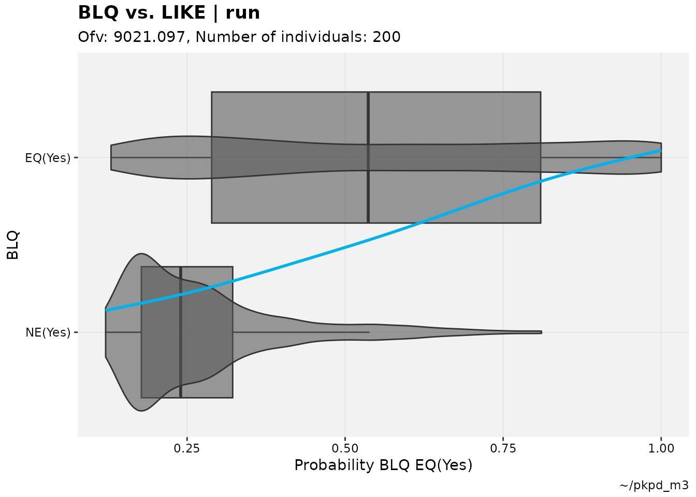

It is expected that there will be a somewhat sigmoidal or at least up-
and right-ward relationship between the two sets of observations in an
adequate model, but as with all diagnostics the interpretation for this
plot is subjective to an extent.

All plots for categorical DVs have at most two sets of data. It is
untested what would happen if all observations fell into one category,
but it is unlikely to produce a good model. This is relevant because the
`catdv` functions can still be used for models that have multiple
levels, such as the vismodegib muscle spasm model (from Lu et al.) built
into the examples. For these models, the plot is essentially
dichotomizing the probability of one observation compared to the
probability of not that observation,

``` r
vismo_xpdb <- vismo_pomod  %>%
  set_var_types(.problem=1, catdv=DV, dvprobs=matches("^P\\d+$")) %>%
  set_dv_probs(.problem=1, 0~P0,1~P1,ge(2)~P23)
vismo_xpdb %>%
  catdv_vs_dvprobs(quiet=TRUE)
#> `geom_smooth()` using method = 'gam' and formula = 'y ~ s(x, bs = "cs")'
```

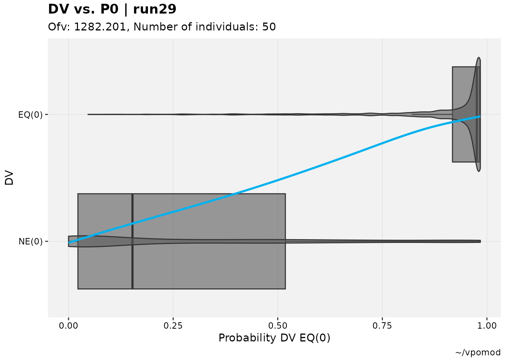

``` r
vismo_xpdb %>%
  catdv_vs_dvprobs(cutpoint = 2, quiet=TRUE)
#> `geom_smooth()` using method = 'gam' and formula = 'y ~ s(x, bs = "cs")'
```

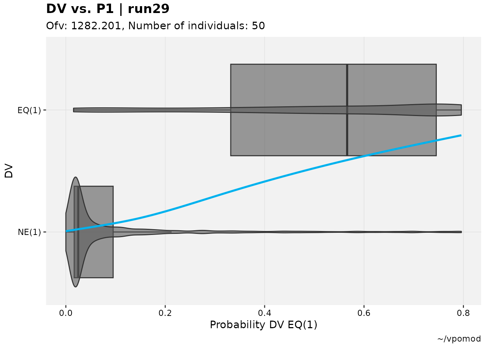

``` r
vismo_xpdb %>%
  catdv_vs_dvprobs(cutpoint = 3, quiet=TRUE)
#> `geom_smooth()` using method = 'gam' and formula = 'y ~ s(x, bs = "cs")'
```

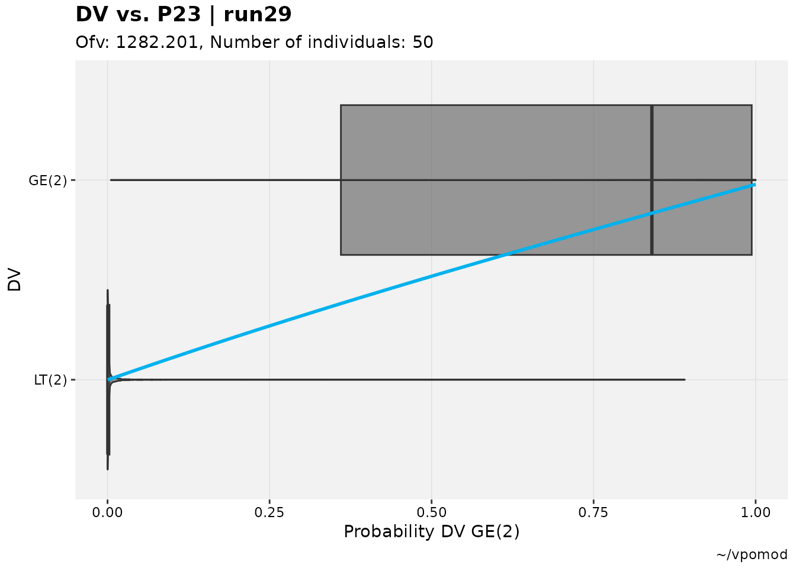

While boxplots and similar are often used in pharmacometrics to
visualize these results (or similar in exposure-response), in the realm
of machine learning Receiver Operating Characteristics (ROC) curves are
also applied to this purpose. To that end, a collection of ROC curve and
space plotting functions have been made available.

Most applications of
[`catdv_vs_dvprobs()`](https://jprybylski.github.io/xpose.xtras/reference/catdv_vs_dvprobs.md)
can be easily repurposed:

``` r
described_pkpd_m3 %>%
  roc_plot(quiet=TRUE)
#> Warning: Some sensitivies and specificities not calculable due to 0s.
```

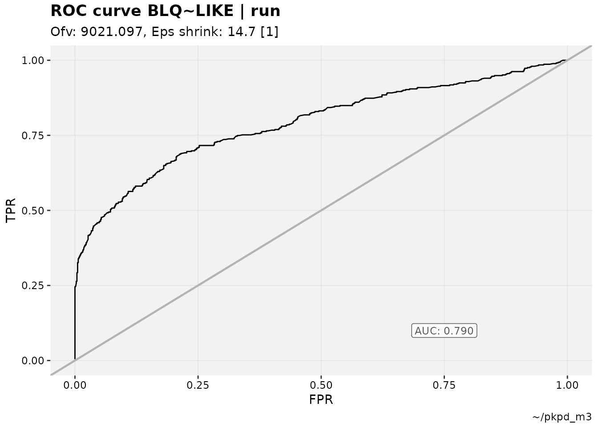

``` r
vismo_xpdb %>%
  # Epsilon shrinkage is still included in default subtitle for M3-like use cases
  roc_plot(cutpoint = 2, quiet=TRUE, subtitle = "Ofv: @ofv") 
#> Warning: Some sensitivies and specificities not calculable due to 0s.
```

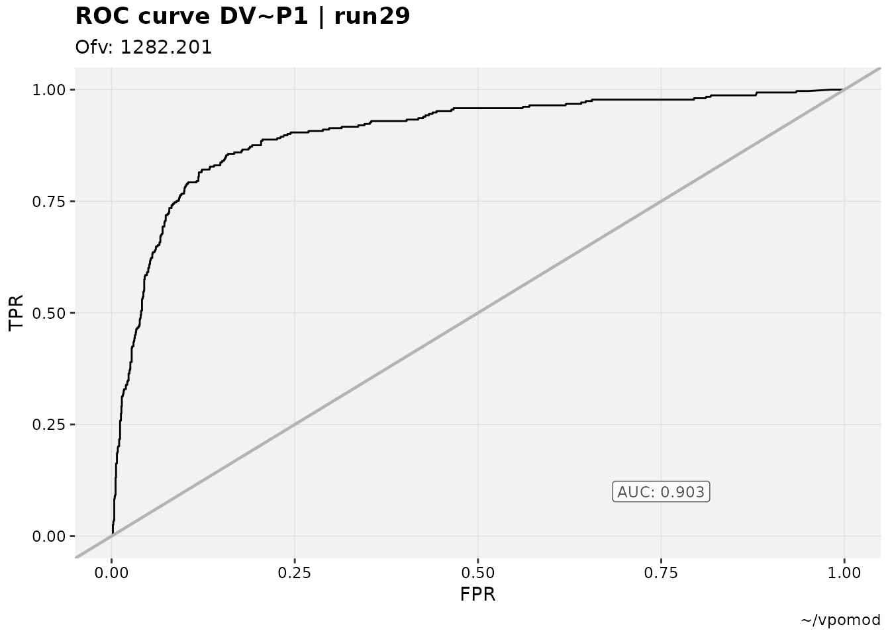 For ROC space
plots, a common grouping is by ID. While there may be a lot of overlap
in the upper left region (the section of the plot where BLQs are most
accurately predicted), the fewer points with lower accuracy (ID 86, for
example) are readily identified as potential outliers.

``` r
described_pkpd_m3 %>%
  roc_plot(quiet=TRUE, group="ID", type="pt")
#> Warning: Some sensitivies and specificities not calculable due to 0s.
#> Warning: Removed 96 rows containing missing values or values outside the scale range
#> (`geom_text()`).
```

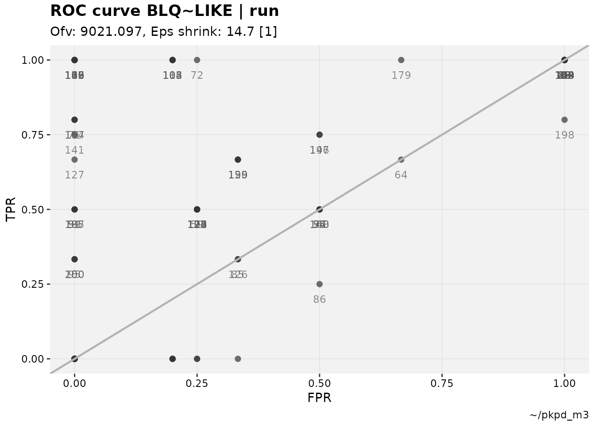 The warning
regarding sensitivities and specificities not being calculable is
trivial, and refers to study participant data in which there is not a
mix of BLQ (in the M3 examples) values; they are either all “true”
positives or all “true” negatives.

## Waterfall and objective function trends

The more common needs for an `xpose_set` include model-building tables,
covariate testing and visualization. However, there are occasions where
a visual description of what can be shown in these tables can be useful.

The default waterfall plot compares scales the change in parameter
values, which is intended to make relative comparisons the focus. This
is especially beneficial in comparing changes in empirical Bayes
estimates (EBEs).

``` r
pheno_set %>%
  eta_waterfall(run3,run6, quiet=TRUE)
```

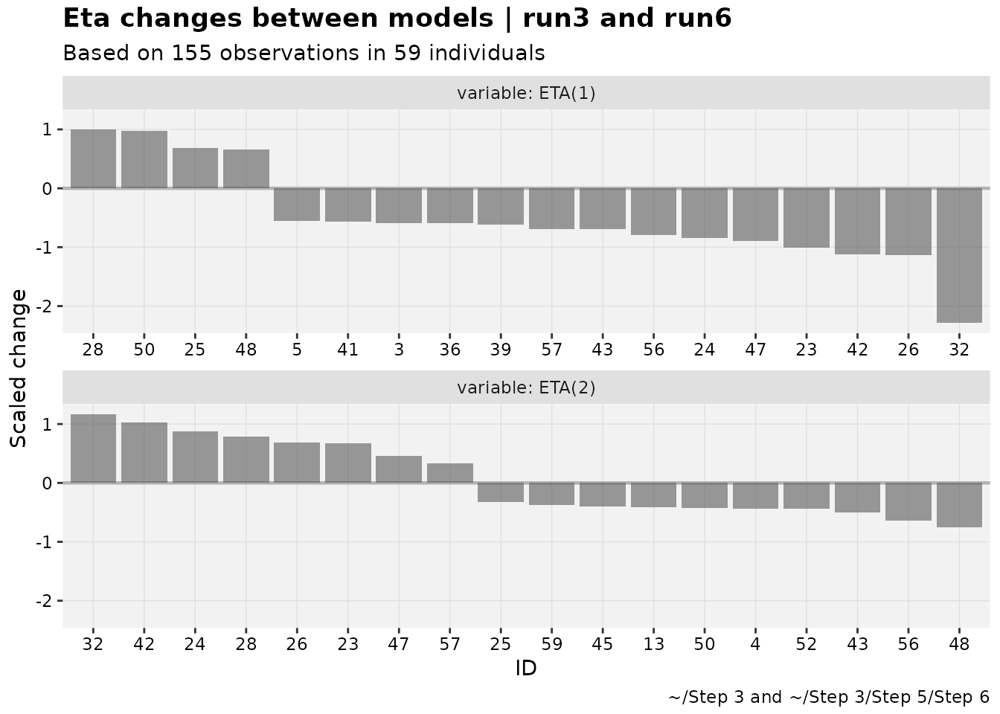

Waterfalls can also be used as an alternative to shark plots. Scaling in
that case is off by default.

``` r
pheno_set %>%
  focus_qapply(backfill_iofv) %>%
  iofv_waterfall(run3,run6, quiet=TRUE)
```

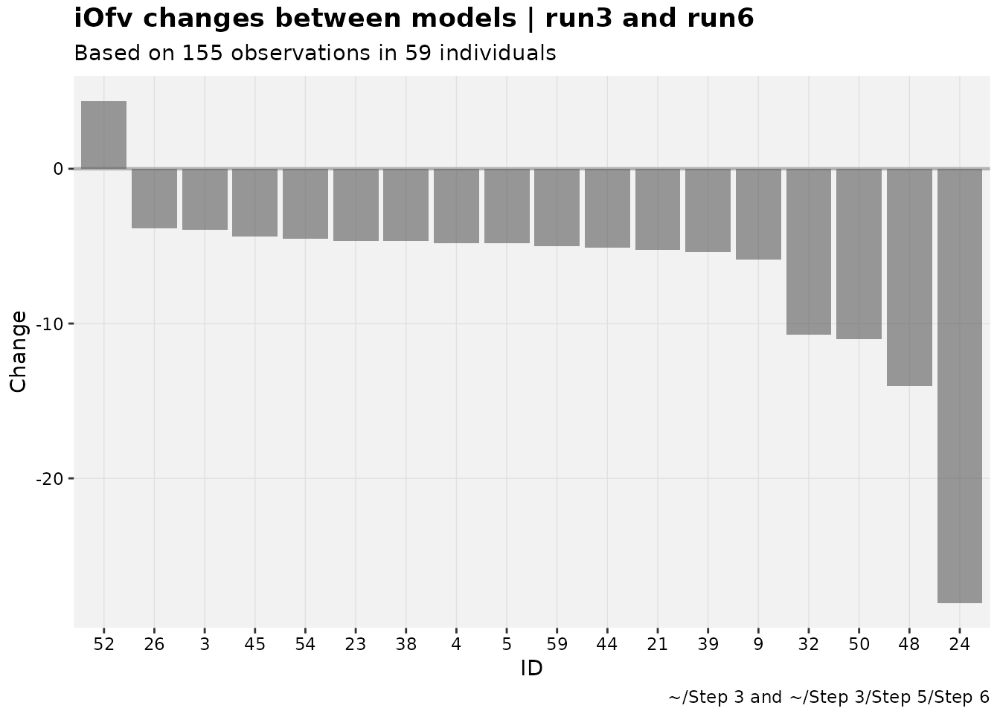

To track iOFV changes over multiple models, another plot can be used.

``` r
iofv_vs_mod(pheno_set, auto_backfill = TRUE, quiet=TRUE)
```

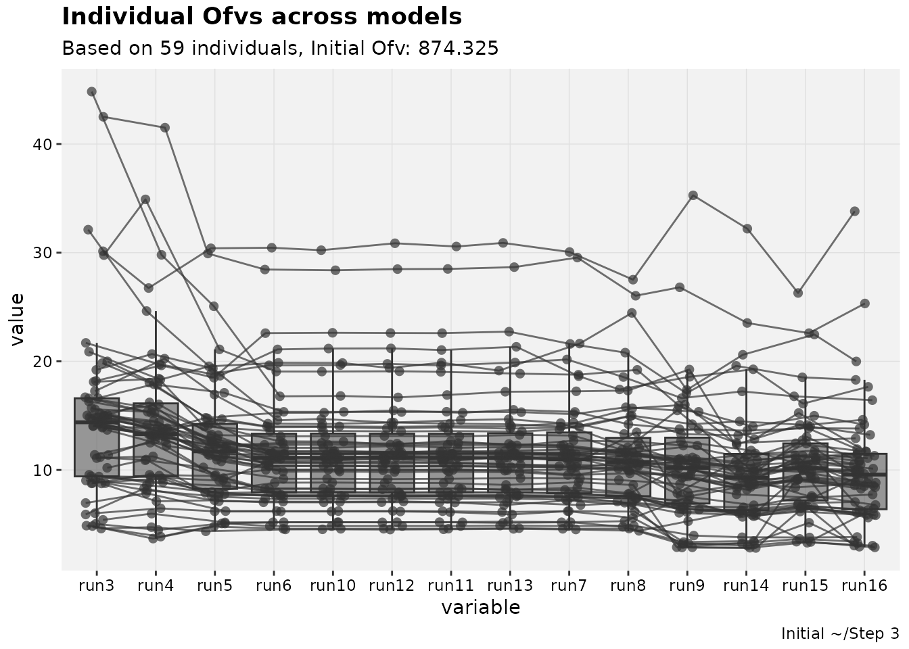
