# Polishing plot output: labels, watermarks, and session options

## Introduction

A model diagnostic is rarely just a diagnostic once it leaves an R
session. It becomes a figure in a report, and figures in reports want
consistent titles, an obvious “this is a draft” stamp while a model is
still in flux, and a predictable place to land on disk. Doing all of
that by hand, plot-by-plot and model-by-model, gets old fast.

`xpose.xtras` adds a small, composable toolkit for this last mile:

- [`apply_default_labs()`](https://jprybylski.github.io/xpose.xtras/reference/apply_default_labs.md)
  /
  [`set_default_labs()`](https://jprybylski.github.io/xpose.xtras/reference/set_default_labs.md)
  fill in (or overwrite) plot titles, subtitles, captions and tags.
- [`add_watermark()`](https://jprybylski.github.io/xpose.xtras/reference/add_watermark.md)
  /
  [`set_default_watermark()`](https://jprybylski.github.io/xpose.xtras/reference/set_default_watermark.md)
  stamp a plot with draft/preliminary/confidential-style text.
- [`ggsave_xp()`](https://jprybylski.github.io/xpose.xtras/reference/ggsave_xp.md)
  saves a plot, applying the above first, with a swappable save backend.
- [`plot.xpose_data()`](https://jprybylski.github.io/xpose.xtras/reference/plot.xpose_data.md)
  /
  [`set_default_plots()`](https://jprybylski.github.io/xpose.xtras/reference/set_default_plots.md)
  generate a whole batch of diagnostic plots from one `xpdb` in a single
  call.

All four read from the same kind of layered defaults, resolved in the
same order every time: a session-wide R option, then a per-model
(`xpdb`) default, then whatever is passed directly to the function call.
[`set_xtras_options()`](https://jprybylski.github.io/xpose.xtras/reference/set_xtras_options.md)
and
[`get_xtras_option()`](https://jprybylski.github.io/xpose.xtras/reference/get_xtras_option.md)
round this out by giving the whole `xpose.xtras.*` option family one
place to be set and inspected.

Once a default is actually configured, it applies itself.
[`print.xpose_plot()`](https://jprybylski.github.io/xpose.xtras/reference/print.xpose_plot.md)
and
[`ggsave_xp()`](https://jprybylski.github.io/xpose.xtras/reference/ggsave_xp.md)
both pick up a configured `default_labs`/`default_watermark`
automatically, with nothing else to call. That behavior is controlled by
the `xpose.xtras.auto_apply` option, `TRUE` unless changed; it’s a no-op
until something is configured, so nothing changes for existing code
until a default is actually set. The functions below are still the way
to configure those defaults in the first place, apply them explicitly on
demand, or reach an `xpdb`-level default (which, unlike the option,
[`print()`](https://rdrr.io/r/base/print.html) has no way to pick up on
its own; see the note under
[`apply_default_labs()`](https://jprybylski.github.io/xpose.xtras/reference/apply_default_labs.md)).
The last section, [Automatic application](#automatic-application),
covers the auto-apply behavior itself.

## Default labels

[`apply_default_labs()`](https://jprybylski.github.io/xpose.xtras/reference/apply_default_labs.md)
takes a `ggplot`/`xpose_plot` object and fills in any of
`title`/`subtitle`/`caption`/`tag` that aren’t already set, using (in
increasing precedence) the `xpose.xtras.default_labs` option, an
`xpdb`-level default, and anything passed directly.

The simplest use is a session-wide option, handy for something that
should apply to every plot in a script or report, like a draft caption:

``` r

options(xpose.xtras.default_labs = list(caption = "DRAFT: do not distribute"))

p <- dv_vs_ipred(xpdb_ex_pk, quiet = TRUE)
p_labelled <- apply_default_labs(p)
p_labelled
#> `geom_smooth()` using formula = 'y ~ x'
```


Because `dv_vs_ipred()` already sets its own caption, that one wasn’t
touched.
[`apply_default_labs()`](https://jprybylski.github.io/xpose.xtras/reference/apply_default_labs.md)
only fills in labels that are still empty. Passing `overwrite = TRUE`
replaces existing labels too, and the value can use the same `@keyword`
placeholders
[`xpose::parse_title()`](https://uupharmacometrics.github.io/xpose/reference/parse_title.html)
understands elsewhere in the package:

``` r

apply_default_labs(p, caption = "Run @run, @nobs observations", overwrite = TRUE)
#> `geom_smooth()` using formula = 'y ~ x'
```

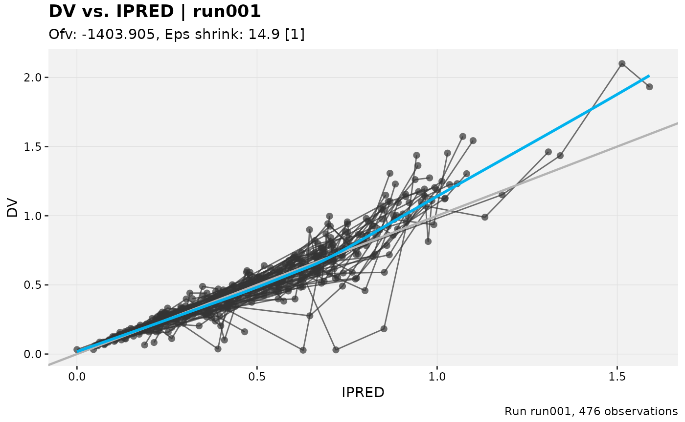

``` r

options(xpose.xtras.default_labs = NULL)
```

A single global caption is a blunt instrument once more than one model
is in play.
[`set_default_labs()`](https://jprybylski.github.io/xpose.xtras/reference/set_default_labs.md)
attaches label defaults to a specific `xpdb` instead, and those take
precedence over the option. This is useful when different models in the
same report need different framing:

``` r

xpdb_draft <- xpdb_x %>%
  set_default_labs(caption = "Model @run, interim, subject to change")

dv_vs_ipred(xpdb_draft, quiet = TRUE) %>%
  apply_default_labs(xpdb = xpdb_draft, overwrite = TRUE)
#> `geom_smooth()` using formula = 'y ~ x'
```

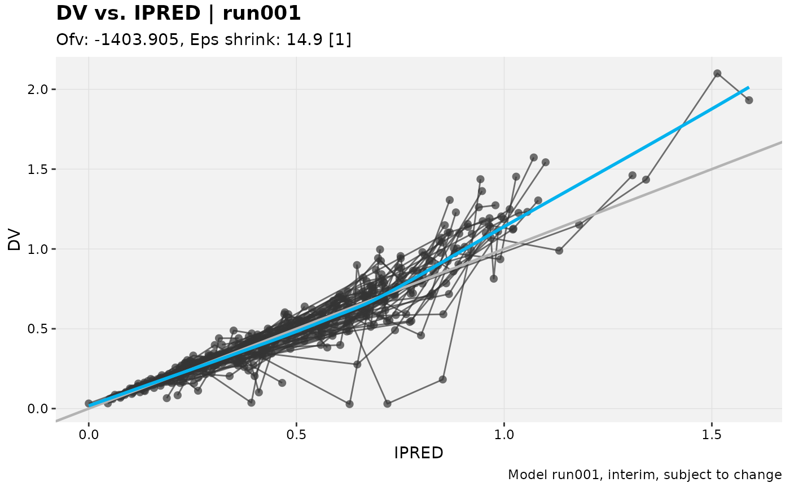

[`apply_default_labs()`](https://jprybylski.github.io/xpose.xtras/reference/apply_default_labs.md)
can’t reach back into the `xpdb` a plot was built from on its own.
`xpose`’s plotting functions only carry a reduced summary forward onto
the plot object, not the full `xpdb`, so the `xpdb` argument has to be
supplied explicitly whenever the `xpdb`-level tier (or `@keyword`
resolution) should be used. Whatever is passed directly to
[`apply_default_labs()`](https://jprybylski.github.io/xpose.xtras/reference/apply_default_labs.md)
still wins over both tiers:

``` r

dv_vs_ipred(xpdb_draft, quiet = TRUE) %>%
  apply_default_labs(caption = "Final for submission", xpdb = xpdb_draft, overwrite = TRUE)
#> `geom_smooth()` using formula = 'y ~ x'
```

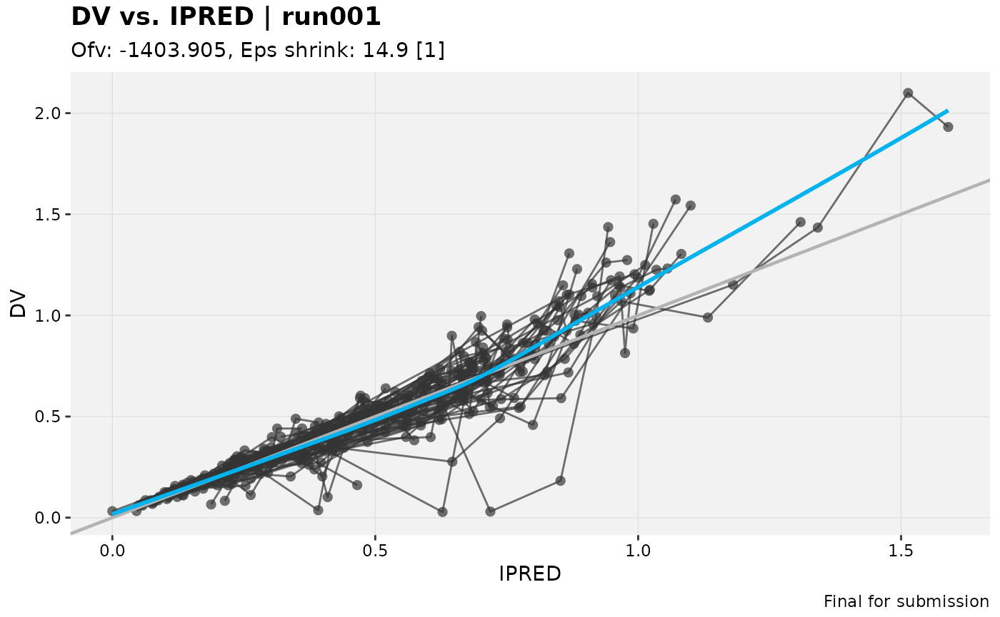

## Watermarks

[`add_watermark()`](https://jprybylski.github.io/xpose.xtras/reference/add_watermark.md)
overlays large, semi-transparent, rotated text across a plot, the kind
of stamp that makes it obvious at a glance that a figure isn’t final
yet.

``` r

p %>%
  add_watermark()
#> `geom_smooth()` using formula = 'y ~ x'
```


`label`, `colour`, `alpha`, `size`, `angle` and `fontface` are all
adjustable:

``` r

p %>%
  add_watermark(label = "PRELIMINARY", colour = "firebrick", alpha = 0.15, angle = 20)
#> `geom_smooth()` using formula = 'y ~ x'
```

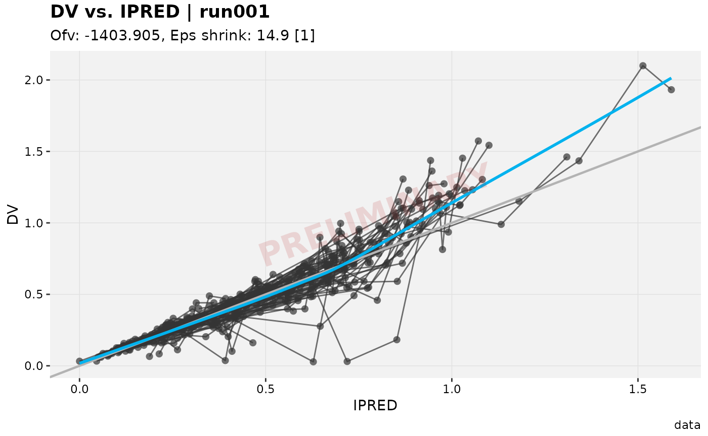

The watermark is added as an ordinary `ggplot2` layer, so it survives
faceting and pagination: one watermark per panel, automatically:

``` r

dv_vs_ipred(xpdb_ex_pk, quiet = TRUE, facets = "SEX") %>%
  add_watermark(label = "DRAFT")
#> `geom_smooth()` using formula = 'y ~ x'
```

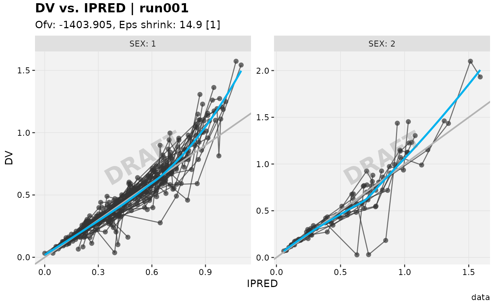

Because the watermark is drawn at a fixed rotation, it can visually
merge into a plot that already has a strong diagonal of its own, like
the line of unity on a `dv_vs_pred()` plot. The default 30 degree angle
sits close to that line and gets lost among the points around it:

``` r

pred_plot <- dv_vs_pred(xpdb_ex_pk, quiet = TRUE)

pred_plot %>%
  add_watermark(alpha = 0.6)
#> `geom_smooth()` using formula = 'y ~ x'
```


Crossing the other way keeps the watermark clearly legible instead,
without competing with the plot’s own diagonal. This is exactly the kind
of case `angle` (and `alpha`/`size`/`colour`) exist for:

``` r

pred_plot %>%
  add_watermark(alpha = 0.6, angle = -45)
#> `geom_smooth()` using formula = 'y ~ x'
```

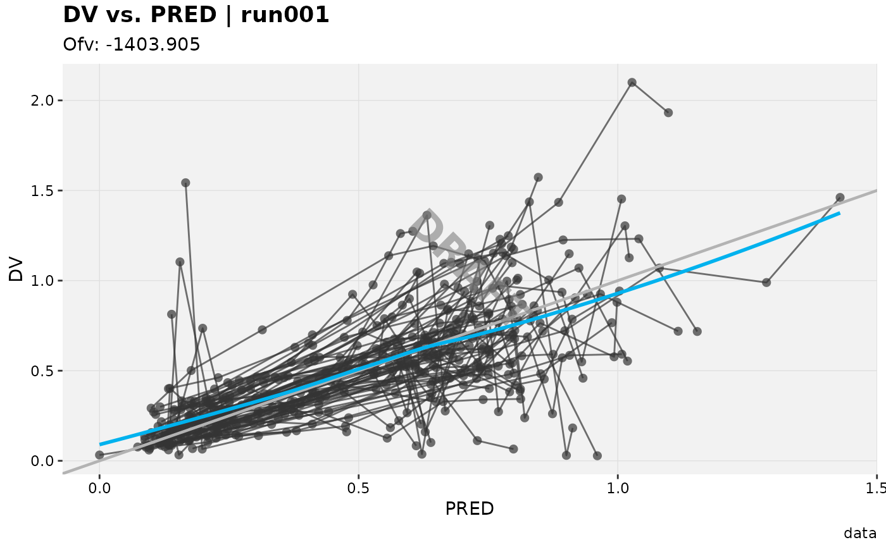

Like the label functions, watermark settings resolve from the
`xpose.xtras.default_watermark` option, then an `xpdb`-level default set
with
[`set_default_watermark()`](https://jprybylski.github.io/xpose.xtras/reference/set_default_watermark.md),
then whatever is passed directly. A whole project can default to, say, a
red “CONFIDENTIAL” stamp without repeating those arguments at every call
site:

``` r

options(xpose.xtras.default_watermark = list(label = "CONFIDENTIAL", colour = "firebrick"))
p %>%
  add_watermark()
#> `geom_smooth()` using formula = 'y ~ x'
```

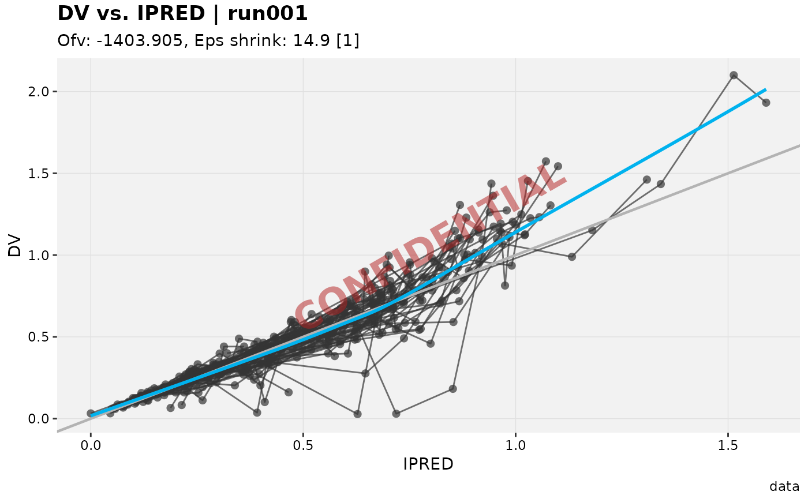

``` r

options(xpose.xtras.default_watermark = NULL)
```

## Generating a batch of plots with `plot()`

Building a standard set of diagnostics for a model usually means calling
several plotting functions one after another, then doing it all again
for the next model.
[`plot.xpose_data()`](https://jprybylski.github.io/xpose.xtras/reference/plot.xpose_data.md)
(an S3 method for the base
[`plot()`](https://rdrr.io/r/graphics/plot.default.html) generic) runs a
whole list of plot-generating calls in one go and returns them as a
flat, named list.

Called with no `plots` argument, it runs this package’s built-in default
battery: `dv_vs_ipred`, `dv_vs_pred`, `res_vs_idv`, `res_vs_pred`,
`eta_distrib`, `eta_grid`, `eta_vs_cov_grid`, and `ind_plots_sample`.

``` r

default_plots <- plot(xpdb_x, quiet = TRUE)
#> Using data from $prob no.1
#> Filtering data by EVID == 0
#> Using data from $prob no.1
#> Filtering data by EVID == 0
#> Using data from $prob no.1
#> Filtering data by EVID == 0
#> Using data from $prob no.1
#> Filtering data by EVID == 0
#> Using data from $prob no.1
#> Removing duplicated rows based on: ID
#> Tidying data by ID, SEX, MED1, MED2, DOSE ... and 23 more variables
#> Using data from $prob no.1
#> Removing duplicated rows based on: ID
#> Using data from $prob no.1
#> Removing duplicated rows based on: ID
#> Using data from $prob no.1
#> Filtering data by EVID == 0
#> Tidying data by ID, SEX, MED1, MED2, DOSE ... and 23 more variables
names(default_plots)
#> [1] "dv_vs_ipred"      "dv_vs_pred"       "res_vs_idv"       "res_vs_pred"     
#> [5] "eta_distrib"      "eta_grid"         "eta_vs_cov_grid"  "ind_plots_sample"
default_plots$dv_vs_ipred
#> `geom_smooth()` using formula = 'y ~ x'
```

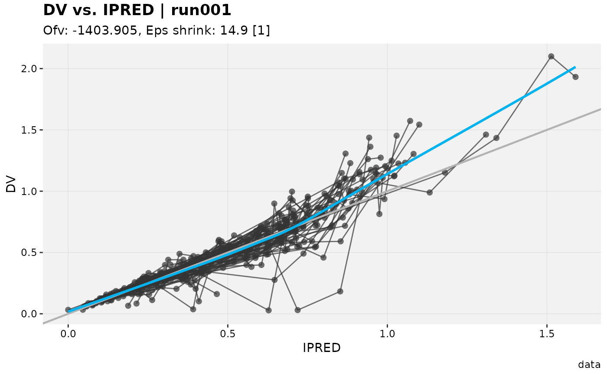

A custom `plots` list can mix bare functions and one-sided formulas in
the `~ fn(.x)` idiom used elsewhere in this package (see
[`focus_function()`](https://jprybylski.github.io/xpose.xtras/reference/focus_xpdb.md)).
The formula form lets extra arguments be baked straight into the call,
which is also how the same underlying plot function can appear more than
once with different options:

``` r

custom_plots <- plot(
  xpdb_x,
  plots = list(
    xpose::dv_vs_ipred,
    ~ xpose::res_vs_idv(.x, res = "CWRES"),
    ~ xpose::res_vs_idv(.x, res = "IWRES")
  ),
  quiet = TRUE
)
#> Using data from $prob no.1
#> Filtering data by EVID == 0
#> Using data from $prob no.1
#> Filtering data by EVID == 0
#> Using data from $prob no.1
#> Filtering data by EVID == 0
names(custom_plots)
#> [1] "plot_1"                "xpose::res_vs_idv...2" "xpose::res_vs_idv...3"
```

If a single entry itself returns a list of plots, that list is flattened
into the overall output rather than kept nested, so the result is always
a flat list regardless of what any one entry produces.

A failing plot, by default, aborts the whole call immediately (showing
the original error as its cause) without returning anything – useful
when a batch of plots feeds directly into a report and a silent gap
would be worse than stopping early. Passing `force = TRUE` instead turns
a failure into a warning and skips just that entry, so the rest of
`plots` still gets a chance to run:

``` r

flaky_plots <- plot(
  xpdb_x,
  plots = list(
    xpose::dv_vs_ipred,
    ~ stop("simulated failure"),
    xpose::eta_distrib
  ),
  force = TRUE,
  quiet = FALSE
)
#> Using data from $prob no.1
#> Filtering data by EVID == 0
#> Warning: Failed to generate the "stop" plot (2 of 3); skipping.
#> Caused by error in `fn()`:
#> ! simulated failure
#> Using data from $prob no.1
#> Removing duplicated rows based on: ID
#> Tidying data by ID, SEX, MED1, MED2, DOSE ... and 23 more variables
#> ! 1 of 3 plot(s) failed and was skipped: "stop"
names(flaky_plots)
#> [1] "plot_1" "plot_3"
```

Like `default_labs`/`default_watermark`, a project-wide `plots` spec can
be set once via the `xpose.xtras.default_plots` session option (see
[`set_xtras_options()`](https://jprybylski.github.io/xpose.xtras/reference/set_xtras_options.md)),
or attached to a specific `xpdb` with
[`set_default_plots()`](https://jprybylski.github.io/xpose.xtras/reference/set_default_plots.md),
which takes precedence over the option. Unlike those two, though, this
default is resolved as a whole rather than merged entry by entry – a
plot spec’s entries aren’t addressable by a stable key, since the same
function can legitimately appear more than once:

``` r

xpdb_custom <- set_default_plots(xpdb_x, list(~ xpose::dv_vs_ipred(.x), ~ xpose::eta_distrib(.x)))
names(plot(xpdb_custom, quiet = TRUE))
#> Using data from $prob no.1
#> Filtering data by EVID == 0
#> Using data from $prob no.1
#> Removing duplicated rows based on: ID
#> Tidying data by ID, SEX, MED1, MED2, DOSE ... and 23 more variables
#> [1] "xpose::dv_vs_ipred" "xpose::eta_distrib"
```

## Saving with `ggsave_xp()`

[`ggsave_xp()`](https://jprybylski.github.io/xpose.xtras/reference/ggsave_xp.md)
is a drop-in,
[`ggplot2::ggsave()`](https://ggplot2.tidyverse.org/reference/ggsave.html)-compatible
way to write a plot to disk: same
`plot`/`filename`/`path`/`width`/`height` arguments, but it applies
[`apply_default_labs()`](https://jprybylski.github.io/xpose.xtras/reference/apply_default_labs.md)/[`add_watermark()`](https://jprybylski.github.io/xpose.xtras/reference/add_watermark.md)
first (`apply_labs`/`apply_watermark`, more on those in [Automatic
application](#automatic-application)), and `path`/`width`/`height` fall
back to the `xpose.xtras.save_dir`/`save_width`/`save_height` options
when not supplied.

``` r

out_dir <- tempdir()

saved_path <- ggsave_xp(p, filename = "dv_vs_ipred.png", path = out_dir, width = 6, height = 4)
#> `geom_smooth()` using formula = 'y ~ x'
basename(saved_path)
#> [1] "dv_vs_ipred.png"
```

That’s a real file on disk. Here’s what actually got written:

    #> [1] TRUE

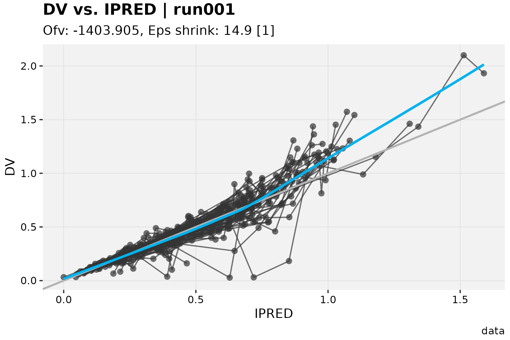

`filename`/`path` can also use `@keyword` placeholders, expanded the
same way
[`xpose::xpose_save()`](https://uupharmacometrics.github.io/xpose/reference/xpose_save.html)
does it:

``` r

run_path <- ggsave_xp(dv_vs_ipred(xpdb_ex_pk, quiet = TRUE), filename = "@run_@plotfun.png", path = out_dir)
#> `geom_smooth()` using formula = 'y ~ x'
basename(run_path)
#> [1] "run001_dv_vs_ipred.png"
```

What actually does the saving is itself swappable, via `save_fun`. The
default is
[`ggplot2::ggsave()`](https://ggplot2.tidyverse.org/reference/ggsave.html),
but anything sharing its signature works, including third-party wrappers
like `reportifyr::ggsave_with_metadata()`. As a self-contained
illustration, so this vignette doesn’t need to depend on a third-party
package just to demonstrate the idea, here’s a `save_fun` that writes a
plain-text note alongside the image:

``` r

save_with_note <- function(plot, filename, path = NULL, width, height, note = "", ...) {
  saved <- ggplot2::ggsave(filename = filename, plot = plot, path = path, width = width, height = height, ...)
  writeLines(note, sub("\\.[^.]+$", ".txt", saved))
  saved
}

annotated_path <- ggsave_xp(
  p, filename = "dv_vs_ipred_annotated.png", path = out_dir,
  save_fun = save_with_note, note = "Generated for the Q3 interim analysis."
)
#> `geom_smooth()` using formula = 'y ~ x'

# the .png was written by ggplot2::ggsave() as usual; the .txt is new
readLines(sub("\\.png$", ".txt", annotated_path))
#> [1] "Generated for the Q3 interim analysis."
```

Any function accepting `plot`/`filename`/`path`/`width`/`height` (plus
whatever else it needs via `...`) can be dropped in this way. There’s
nothing `xpose.xtras`-specific about `save_fun` itself.

## Automatic application

Everything above can be called explicitly, but it doesn’t have to be.
Once a `default_labs`/`default_watermark` is actually configured, at the
option level, as in the examples so far,
[`print.xpose_plot()`](https://jprybylski.github.io/xpose.xtras/reference/print.xpose_plot.md)
and
[`ggsave_xp()`](https://jprybylski.github.io/xpose.xtras/reference/ggsave_xp.md)
apply it on their own:

``` r

options(
  xpose.xtras.default_labs = list(caption = "DRAFT: do not distribute"),
  xpose.xtras.default_watermark = list(label = "DRAFT")
)

dv_vs_ipred(xpdb_ex_pk, quiet = TRUE)
#> `geom_smooth()` using formula = 'y ~ x'
```

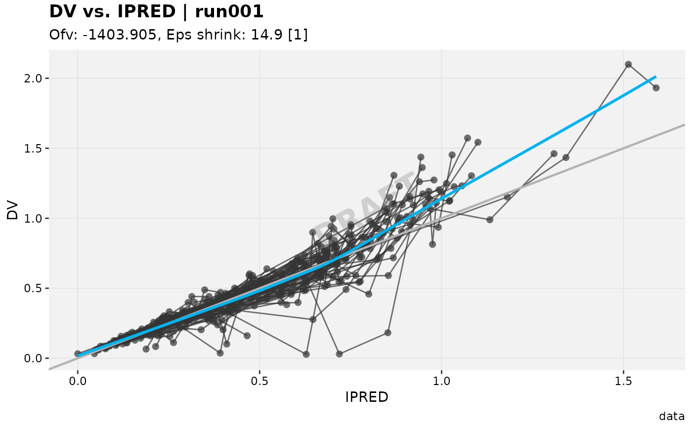

No
[`apply_default_labs()`](https://jprybylski.github.io/xpose.xtras/reference/apply_default_labs.md),
no
[`add_watermark()`](https://jprybylski.github.io/xpose.xtras/reference/add_watermark.md),
just an ordinary `dv_vs_ipred()` call, printed the ordinary way. This is
exactly what happens when a plot auto-prints at the console or in a
knitted report. It’s controlled by the `xpose.xtras.auto_apply` option,
`TRUE` unless changed. Note that it’s the *configured* default that’s
applied automatically, not an unconditional one: with
`default_watermark` left unset, `auto_apply = TRUE` would not stamp a
“DRAFT” on every plot on its own. It’s purely “apply what was already
configured, without asking again.”

To turn this off everywhere at once:

``` r

options(xpose.xtras.auto_apply = FALSE)

dv_vs_ipred(xpdb_ex_pk, quiet = TRUE)
#> `geom_smooth()` using formula = 'y ~ x'
```


Or, to opt out for one
[`ggsave_xp()`](https://jprybylski.github.io/xpose.xtras/reference/ggsave_xp.md)
call without touching the option, pass
`apply_labs = FALSE`/`apply_watermark = FALSE` directly to that call.

Either way, this only ever reaches the session-wide option tier.
[`print()`](https://rdrr.io/r/base/print.html) has no way to receive the
`xpdb` a plot was built from, so an `xpdb`-level default (set via
[`set_default_labs()`](https://jprybylski.github.io/xpose.xtras/reference/set_default_labs.md)/[`set_default_watermark()`](https://jprybylski.github.io/xpose.xtras/reference/set_default_watermark.md))
still needs
[`apply_default_labs()`](https://jprybylski.github.io/xpose.xtras/reference/apply_default_labs.md)/[`add_watermark()`](https://jprybylski.github.io/xpose.xtras/reference/add_watermark.md),
or
[`ggsave_xp()`](https://jprybylski.github.io/xpose.xtras/reference/ggsave_xp.md)’s
`xpdb` argument, called explicitly. Auto-apply covers the common “one
default for the whole session” case, not the per-model one.

## Tying it together with session options

Setting several of the options above one at a time is easy to get wrong:
a typo in an option name just silently does nothing, since
[`options()`](https://rdrr.io/r/base/options.html) doesn’t validate
names.
[`set_xtras_options()`](https://jprybylski.github.io/xpose.xtras/reference/set_xtras_options.md)
is a small, validated wrapper for the whole `xpose.xtras.*` family
(prefix added automatically), good for pinning a project’s defaults once
at the top of a script:

``` r

set_xtras_options(
  default_labs = list(caption = "DRAFT"),
  default_watermark = list(label = "DRAFT"),
  save_dir = tempdir(),
  save_width = 6,
  save_height = 4
)

# labels and watermark are auto-applied, and save_dir/save_width/save_height
# supply filename's path/width/height: one call, nothing else configured
saved_together <- ggsave_xp(dv_vs_ipred(xpdb_ex_pk, quiet = TRUE), filename = "tied_together.png")
#> `geom_smooth()` using formula = 'y ~ x'
basename(saved_together)
#> [1] "tied_together.png"
```

    #> [1] TRUE

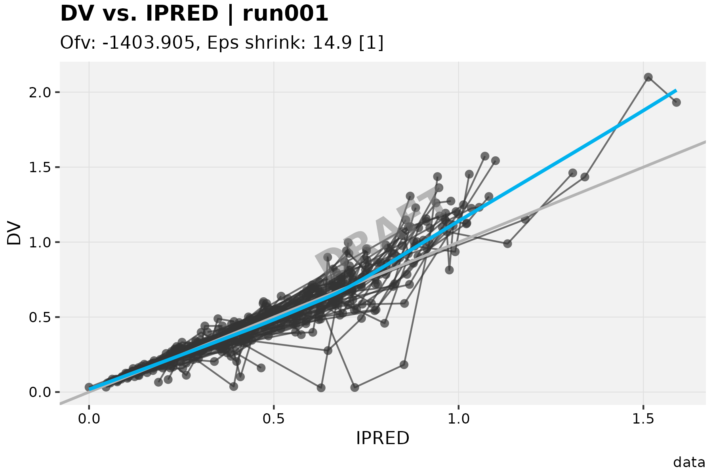

The same family also covers a session-wide default theme,
`gg_theme`/`xp_theme`, picked up automatically the first time an
`xpose_data` object is converted with
[`as_xpdb_x()`](https://jprybylski.github.io/xpose.xtras/reference/xp_xtras.md).
A project look can be set once instead of calling
[`xpose::update_themes()`](https://uupharmacometrics.github.io/xpose/reference/update_themes.html)
on every model:

``` r

set_xtras_options(gg_theme = theme_bw)

xpdb_ex_pk %>%
  as_xpdb_x() %>%
  dv_vs_ipred(quiet = TRUE)
#> `geom_smooth()` using formula = 'y ~ x'
```

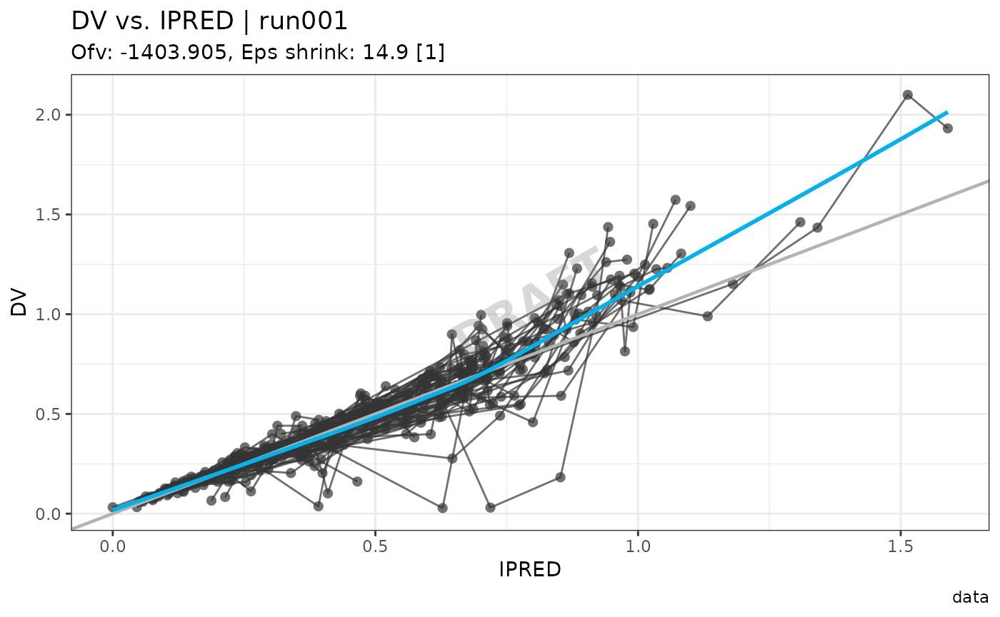

[`get_xtras_option()`](https://jprybylski.github.io/xpose.xtras/reference/get_xtras_option.md)
reports, for a given option and (optionally) a specific `xpdb`, what’s
currently set at each tier and which one would win:

``` r

xpdb_labelled <- xpdb_x %>%
  set_default_labs(caption = "Model-specific caption")

get_xtras_option("default_labs", xpdb_labelled)
#> $option
#> $option$caption
#> [1] "DRAFT"
#> 
#> 
#> $xpdb
#> $xpdb$caption
#> [1] "Model-specific caption"
#> 
#> 
#> $dominant
#> [1] "xpdb"
```

The full list of recognized options, what each one does, and which ones
have an `xpdb`-level counterpart, is documented on
[`?set_xtras_options`](https://jprybylski.github.io/xpose.xtras/reference/set_xtras_options.md).
