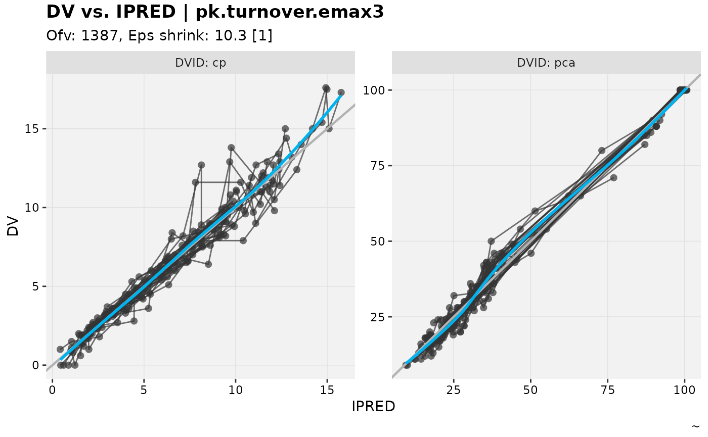
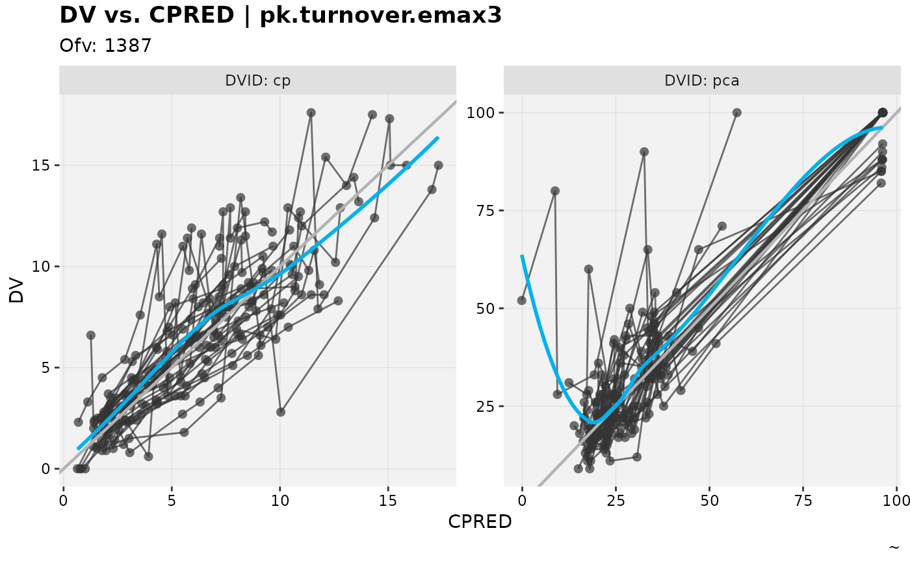
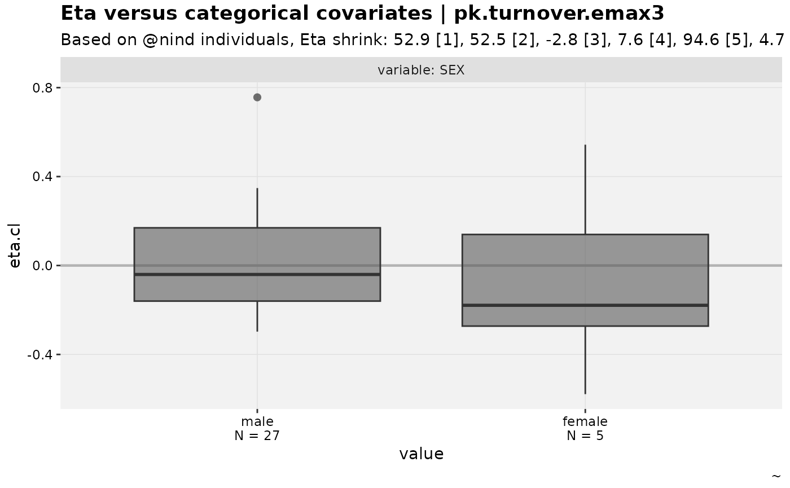
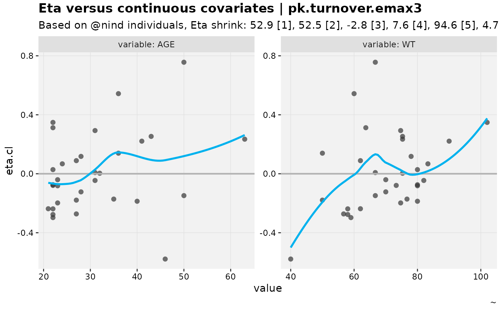
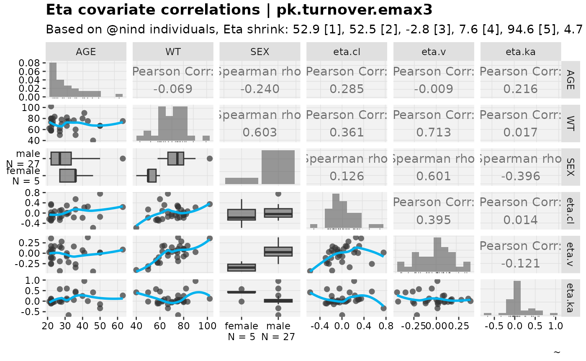
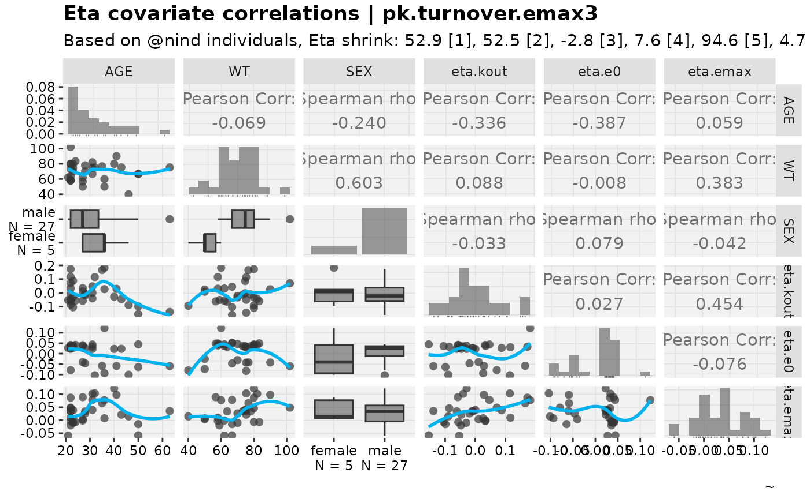
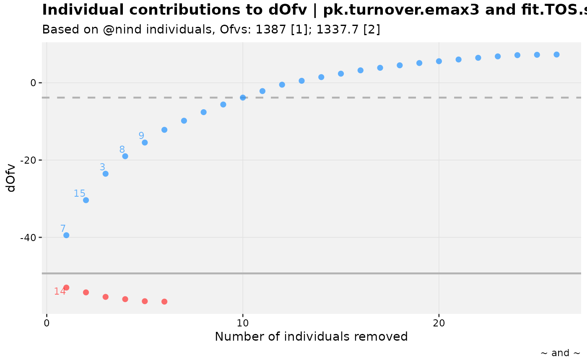
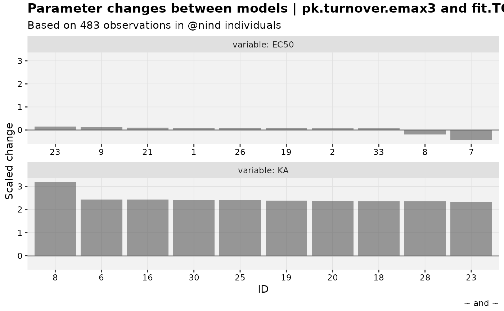
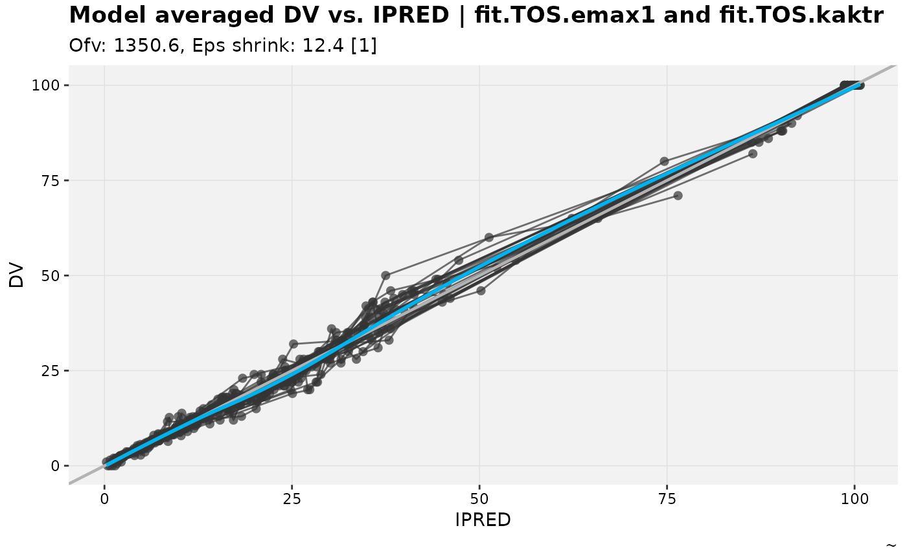

# nlmixr2 Support

``` r
library(nlmixr2)
library(xpose)
library(xpose.xtras)
set.seed(42^2)
```

`nlmixr2` fits are fully supported in the current release, including
many convenience functions to ensure consumed `nlmixr2` results are
fully compatible with most all available features of `xpose` and
`xpose.xtras`.

## Basics

While the `xpose.xtras` package already contains a few `nlmixr2`
examples, let’s start fresh with a new fit. The model below is from [the
`nlmixr2`
documentation](https://nlmixr2.org/articles/multiple-endpoints.html); to
start using the resulting `xpose_data` directly, refer to
[`?nlmixr2_warfarin`](https://jprybylski.github.io/xpose.xtras/reference/nlmixr2_warfarin.md).

``` r
pk.turnover.emax3 <- function() {
  ini({
    tktr <- log(1)
    tka <- log(1)
    tcl <- log(0.1)
    tv <- log(10)
    ##
    eta.ktr ~ 1
    eta.ka ~ 1
    eta.cl ~ 2
    eta.v ~ 1
    prop.err <- 0.1
    pkadd.err <- 0.1
    ##
    temax <- logit(0.8)
    tec50 <- log(0.5)
    tkout <- log(0.05)
    te0 <- log(100)
    ##
    eta.emax ~ .5
    eta.ec50  ~ .5
    eta.kout ~ .5
    eta.e0 ~ .5
    ##
    pdadd.err <- 10
  })
  model({
    ktr <- exp(tktr + eta.ktr)
    ka <- exp(tka + eta.ka)
    cl <- exp(tcl + eta.cl)
    v <- exp(tv + eta.v)
    emax = expit(temax+eta.emax)
    ec50 =  exp(tec50 + eta.ec50)
    kout = exp(tkout + eta.kout)
    e0 = exp(te0 + eta.e0)
    ##
    DCP = center/v
    PD=1-emax*DCP/(ec50+DCP)
    ##
    effect(0) = e0
    kin = e0*kout
    ##
    d/dt(depot) = -ktr * depot
    d/dt(gut) =  ktr * depot -ka * gut
    d/dt(center) =  ka * gut - cl / v * center
    d/dt(effect) = kin*PD -kout*effect
    ##
    cp = center / v
    cp ~ prop(prop.err) + add(pkadd.err)
    effect ~ add(pdadd.err) | pca
  })
}
fit.TOS <- nlmixr2(pk.turnover.emax3, warfarin, "focei", control=list(print=0),
                  table=list(cwres=TRUE, npde=TRUE))
#> [====|====|====|====|====|====|====|====|====|====] 0:00:00
#> [====|====|====|====|====|====|====|====|====|====] 0:00:00
#> [====|====|====|====|====|====|====|====|====|====] 0:00:00
#> [====|====|====|====|====|====|====|====|====|====] 0:00:00
#> [====|====|====|====|====|====|====|====|====|====] 0:00:00
#> [====|====|====|====|====|====|====|====|====|====] 0:00:00 
#> 
#> [====|====|====|====|====|====|====|====|====|====] 0:00:00 
#> 
#> [====|====|====|====|====|====|====|====|====|====] 0:00:00
#> [====|====|====|====|====|====|====|====|====|====] 0:00:00
#> [====|====|====|====|====|====|====|====|====|====] 0:00:00
#> [====|====|====|====|====|====|====|====|====|====] 0:00:00
#> [====|====|====|====|====|====|====|====|====|====] 0:00:00
#> calculating covariance matrix
#> [====|====|====|====|====|====|====|====|====|====] 0:01:22 
#> done
```

Now that we have a fit, we have a few options to consume the results
into `xpose`. We could use
[`xpose.nlmixr2::xpose_data_nlmixr2`](https://rdrr.io/pkg/xpose.nlmixr2/man/xpose_data_nlmixr2.html)
and then convert to an `xp_xtras` object from there.

``` r
xpose.nlmixr2::xpose_data_nlmixr2(fit.TOS) %>%
  as_xp_xtras()
#> 
#> ── ~ xp_xtras object 
#> Model description: not implemented
#> fit.TOS overview: 
#>  - Software: nlmixr2 4.1.1 
#>  - Attached files (memory usage 553.8 Kb): 
#>    + obs tabs: $prob no.1: nlmixr2 
#>    + sim tabs: <none> 
#>    + output files: <none> 
#>    + special: <none> 
#>    + fit: <none>
#>  - gg_theme: :: xpose theme_readable 
#>  - xp_theme: xp_xtra_theme new_x$xp_theme 
#>  - Options: dir = NULL, quiet = TRUE, manual_import = NULL, cvtype = exact
```

It is helpful though, for traceability and for some convenience
functions for the fit object to be attached to the `xpose_data` object.

``` r
xpose.nlmixr2::xpose_data_nlmixr2(fit.TOS) %>%
  as_xp_xtras() %>%
  attach_nlmixr2(fit.TOS)
#> 
#> ── ~ xp_xtras object 
#> Model description: not implemented
#> fit.TOS overview: 
#>  - Software: nlmixr2 4.1.1 
#>  - Attached files (memory usage 725.7 Kb): 
#>    + obs tabs: $prob no.1: nlmixr2 
#>    + sim tabs: <none> 
#>    + output files: <none> 
#>    + special: <none> 
#>    + fit: attached as (this)$fit
#>  - gg_theme: :: xpose theme_readable 
#>  - xp_theme: xp_xtra_theme new_x$xp_theme 
#>  - Options: dir = NULL, quiet = TRUE, manual_import = NULL, cvtype = exact
```

One such convenience function is to backfill some of the `"na"`
properties pulled from the fit results (at time of writing, these are
condition number and significant digits). It’s acknowledged that these
backfills are opinionated, hence it is optional.

``` r
xpose.nlmixr2::xpose_data_nlmixr2(fit.TOS) %>%
  as_xp_xtras() %>%
  attach_nlmixr2(fit.TOS) %>%
  backfill_nlmixr2_props() %>%
  {print(get_prop(., "condn")); .} %>%
  get_prop("nsig")
#> [1] "32318.0467755017"
#> [1] "3"
```

A more useful application of the attached fit result is a method to make
[`get_prm()`](https://jprybylski.github.io/xpose.xtras/reference/get_prm.md)
work. Note,
[`xpose::prm_table()`](https://uupharmacometrics.github.io/xpose/reference/prm_table.html)
does not work despite this new feature because it uses the original
[`get_prm()`](https://jprybylski.github.io/xpose.xtras/reference/get_prm.md)
defined within `xpose` namespace. Since
[`prm_table()`](https://uupharmacometrics.github.io/xpose/reference/prm_table.html)
is a quick check convenience function to print in place,
[`get_prm()`](https://jprybylski.github.io/xpose.xtras/reference/get_prm.md)
was considered a better function to get working.

``` r
try({
xpose.nlmixr2::xpose_data_nlmixr2(fit.TOS) %>%
    as_xp_xtras() %>% xpose::get_prm()
})
#> Error : No `files` slot could be found in this xpdb.
xpose.nlmixr2::xpose_data_nlmixr2(fit.TOS) %>%
  as_xp_xtras() %>%
  attach_nlmixr2(fit.TOS) %>%
  get_prm() %>%
  # Remove some columns for readability
  dplyr::select(-c(fixed,diagonal,label))
#> # A tibble: 20 × 9
#>    type  name         value      se      rse     m     n      cv     shk
#>    <chr> <chr>      <num:3> <num:3>  <num:3> <int> <int> <num:3> <num:3>
#>  1 the   tktr         0.104  2.20   21.1         1    NA    NA      NA  
#>  2 the   tka          0.302  2.18    7.23        2    NA    NA      NA  
#>  3 the   tcl         -2.04   0.109   0.0536      3    NA    NA      NA  
#>  4 the   tv           2.06   0.0916  0.0444      4    NA    NA      NA  
#>  5 the   prop.err     0.148 NA      NA           5    NA    NA      NA  
#>  6 the   pkadd.err    0.172 NA      NA           6    NA    NA      NA  
#>  7 the   temax        4.75   6.20    1.30        7    NA    NA      NA  
#>  8 the   tec50        0.157  0.229   1.46        8    NA    NA      NA  
#>  9 the   tkout       -2.93   0.128   0.0436      9    NA    NA      NA  
#> 10 the   te0          4.57   0.0399  0.00874    10    NA    NA      NA  
#> 11 the   pdadd.err    3.76  NA      NA          11    NA    NA      NA  
#> 12 ome   eta.ktr      0.840 NA      NA           1     1   101.     62.3
#> 13 ome   eta.ka       0.944 NA      NA           2     2   120.     60.6
#> 14 ome   eta.cl       0.268 NA      NA           3     3    27.3    -0.1
#> 15 ome   eta.v        0.221 NA      NA           4     4    22.4    10.3
#> 16 ome   eta.emax     0.590 NA      NA           5     5    64.5    95.1
#> 17 ome   eta.ec50     0.453 NA      NA           6     6    47.7     5.2
#> 18 ome   eta.kout     0.153 NA      NA           7     7    15.4    32.3
#> 19 ome   eta.e0       0.103 NA      NA           8     8    10.3    39.6
#> 20 sig   sigma(1,1)   1     NA      NA           1     1    NA      10.7
```

To build on this, because `nlmixr2` coerces users to use mu-referencing
and captures parameter associations automatically, another useful
backfill includes mapping these parameter associations with
[`add_prm_association()`](https://jprybylski.github.io/xpose.xtras/reference/add_prm_association.md),
by way of
[`nlmixr2_prm_associations()`](https://jprybylski.github.io/xpose.xtras/reference/nlmixr2_prm_associations.md).
In this model, `temax` is logit transformed, so to keep assumptions
valid in the CV% calculation it needs to be back-transformed (as
indicated in a `cli` message).

``` r
xpose.nlmixr2::xpose_data_nlmixr2(fit.TOS) %>%
  as_xp_xtras() %>%
  attach_nlmixr2(fit.TOS) %>%
  nlmixr2_prm_associations() %>%
  mutate_prm(temax ~ plogis) %>%
  get_prm() %>%
  # Remove some columns for readability
  dplyr::select(-c(fixed,diagonal,label))
#> # A tibble: 20 × 9
#>    type  name         value      se      rse     m     n      cv     shk
#>    <chr> <chr>      <num:3> <num:3>  <num:3> <int> <int> <num:3> <num:3>
#>  1 the   tktr         0.104  2.20   21.1         1    NA  NA        NA  
#>  2 the   tka          0.302  2.18    7.23        2    NA  NA        NA  
#>  3 the   tcl         -2.04   0.109   0.0536      3    NA  NA        NA  
#>  4 the   tv           2.06   0.0916  0.0444      4    NA  NA        NA  
#>  5 the   prop.err     0.148 NA      NA           5    NA  NA        NA  
#>  6 the   pkadd.err    0.172 NA      NA           6    NA  NA        NA  
#>  7 the   temax        0.991  0.362   0.365       7    NA  NA        NA  
#>  8 the   tec50        0.157  0.229   1.46        8    NA  NA        NA  
#>  9 the   tkout       -2.93   0.128   0.0436      9    NA  NA        NA  
#> 10 the   te0          4.57   0.0399  0.00874    10    NA  NA        NA  
#> 11 the   pdadd.err    3.76  NA      NA          11    NA  NA        NA  
#> 12 ome   eta.ktr      0.840 NA      NA           1     1 101.       62.3
#> 13 ome   eta.ka       0.944 NA      NA           2     2 120.       60.6
#> 14 ome   eta.cl       0.268 NA      NA           3     3  27.3      -0.1
#> 15 ome   eta.v        0.221 NA      NA           4     4  22.4      10.3
#> 16 ome   eta.emax     0.590 NA      NA           5     5   0.647    95.1
#> 17 ome   eta.ec50     0.453 NA      NA           6     6  47.7       5.2
#> 18 ome   eta.kout     0.153 NA      NA           7     7  15.4      32.3
#> 19 ome   eta.e0       0.103 NA      NA           8     8  10.3      39.6
#> 20 sig   sigma(1,1)   1     NA      NA           1     1  NA        10.7
#> # Parameter table includes the following associations: tktr~log(eta.ktr),
#> tka~log(eta.ka), tcl~log(eta.cl), tv~log(eta.v), temax~logit(eta.emax),
#> tec50~log(eta.ec50), tkout~log(eta.kout), and te0~log(eta.e0)
```

That’s a lot of boilerplate to pipe through, so a convenience function
has been developed to cover all of that. Note the parameter associations
are mapped automatically, but we could skip that step if we weren’t
planning to use
[`get_prm()`](https://jprybylski.github.io/xpose.xtras/reference/get_prm.md)
at all by setting `.skip_assoc=TRUE`.

``` r
nlmixr2_warfarin <- nlmixr2_as_xtra(fit.TOS)
```

## General Usage

We covered most of the usage unique to this package in the Basics
section, but this section is to illustrate that common functions will
continue to work. At time of writing, some missing properties are
present and should be added with a
[PR](https://github.com/nlmixr2/xpose.nlmixr2/pull/5) to `xpose.nlmixr2`
(these are not backfill candidates since they don’t exist in the summary
element, violating how
[`set_prop()`](https://jprybylski.github.io/xpose.xtras/reference/set_prop.md)
was designed to work).

``` r
list_vars(nlmixr2_warfarin)
#> List of available variables for problem no. 1
#>  - Subject identifier (id)               : ID
#>  - Dependent variable (dv)               : DV
#>  - Independent variable (idv)            : TIME
#>  - DV identifier (dvid)                  : DVID [0]
#>  - Dose amount (amt)                     : AMT
#>  - Event identifier (evid)               : EVID
#>  - Model typical predictions (pred)      : CPRED
#>  - Model individual predictions (ipred)  : IPRED
#>  - Model parameter (param)               : KA, CL, V
#>  - Eta (eta)                             : eta.ktr, eta.ka, eta.cl, eta.v, eta.emax, eta.ec50, eta.kout, eta.e0
#>  - Residuals (res)                       : NPDE, RES, WRES, IRES, IWRES, CRES, CWRES
#>  - Categorical covariates (catcov)       : SEX [0]
#>  - Continuous covariates (contcov)       : WT, AGE
#>  - Not attributed (na)                   : NLMIXRLLIKOBS, CMT, EPRED, ERES, NPD, PDE, PD, PRED, ETA.KTR, ETA.KA, ETA.CL, ETA.V, ETA.EMAX, ETA.EC50, ETA.KOUT, ETA.E0, DEPOT, GUT, CENTER, EFFECT, KTR, EMAX, EC50, KOUT, E0, DCP, PD.1, KIN, TAD, DOSENUM

dv_vs_ipred(nlmixr2_warfarin, facet="DVID")
#> `geom_smooth()` using formula = 'y ~ x'
```



``` r

dv_vs_pred(nlmixr2_warfarin, facet="DVID")
#> `geom_smooth()` using formula = 'y ~ x'
```



``` r

eta_vs_catcov(nlmixr2_warfarin, etavar = eta.cl)
#> Warning: nind is not part of the available keywords. Check ?template_titles for
#> a full list.
```



``` r
eta_vs_contcov(nlmixr2_warfarin, etavar = eta.cl)
#> Warning: nind is not part of the available keywords. Check ?template_titles for
#> a full list.
#> `geom_smooth()` using formula = 'y ~ x'
```



``` r

eta_vs_cov_grid(nlmixr2_warfarin, etavar = c(eta.cl,eta.v,eta.ka), quiet=TRUE)
#> Warning: nind is not part of the available keywords. Check ?template_titles for
#> a full list.
```



``` r

eta_vs_cov_grid(nlmixr2_warfarin, etavar = c(eta.kout,eta.e0,eta.emax), quiet=TRUE)
#> Warning: nind is not part of the available keywords. Check ?template_titles for
#> a full list.
```



## Sets

A simple change to the warfarin PK model is to use the same parameters
for `ka` and `ktr`. In the PD model, we could also fix `emax` to `1`
(and drop the interindividual variability). An analyst would explore
these separately and then maybe combine them, as we have done below.

``` r
fit.TOS.kaktr <- fit.TOS %>%
  model({
    ka <- ktr
  }) %>%
  nlmixr2(warfarin, "focei",
    control = list(print = 0),
    table = list(cwres = TRUE, npde = TRUE)
  )
#> [====|====|====|====|====|====|====|====|====|====] 0:00:00
#> [====|====|====|====|====|====|====|====|====|====] 0:00:00
#> [====|====|====|====|====|====|====|====|====|====] 0:00:00
#> [====|====|====|====|====|====|====|====|====|====] 0:00:00
#> [====|====|====|====|====|====|====|====|====|====] 0:00:00
#> [====|====|====|====|====|====|====|====|====|====] 0:00:00 
#> 
#> [====|====|====|====|====|====|====|====|====|====] 0:00:00 
#> 
#> [====|====|====|====|====|====|====|====|====|====] 0:00:00
#> [====|====|====|====|====|====|====|====|====|====] 0:00:00
#> [====|====|====|====|====|====|====|====|====|====] 0:00:00
#> [====|====|====|====|====|====|====|====|====|====] 0:00:00
#> [====|====|====|====|====|====|====|====|====|====] 0:00:00
#> calculating covariance matrix
#> [====|====|====|====|====|====|====|====|====|====] 0:00:50 
#> done

fit.TOS.emax1 <- fit.TOS %>%
  model({
    emax = 1
  }) %>%
  nlmixr2(warfarin, "focei",
    control = list(print = 0),
    table = list(cwres = TRUE, npde = TRUE)
  )
#> [====|====|====|====|====|====|====|====|====|====] 0:00:00
#> [====|====|====|====|====|====|====|====|====|====] 0:00:00
#> [====|====|====|====|====|====|====|====|====|====] 0:00:00
#> [====|====|====|====|====|====|====|====|====|====] 0:00:00
#> [====|====|====|====|====|====|====|====|====|====] 0:00:00
#> [====|====|====|====|====|====|====|====|====|====] 0:00:00 
#> 
#> [====|====|====|====|====|====|====|====|====|====] 0:00:00 
#> 
#> [====|====|====|====|====|====|====|====|====|====] 0:00:00
#> [====|====|====|====|====|====|====|====|====|====] 0:00:00
#> [====|====|====|====|====|====|====|====|====|====] 0:00:00
#> [====|====|====|====|====|====|====|====|====|====] 0:00:00
#> [====|====|====|====|====|====|====|====|====|====] 0:00:00
#> calculating covariance matrix
#> [====|====|====|====|====|====|====|====|====|====] 0:00:53 
#> done

fit.TOS.simple <- fit.TOS %>%
  model({
    ka <- ktr
    emax = 1
  }) %>%
  nlmixr2(warfarin, "focei",
    control = list(print = 0),
    table = list(cwres = TRUE, npde = TRUE)
  )
#> [====|====|====|====|====|====|====|====|====|====] 0:00:00
#> [====|====|====|====|====|====|====|====|====|====] 0:00:00
#> [====|====|====|====|====|====|====|====|====|====] 0:00:00
#> [====|====|====|====|====|====|====|====|====|====] 0:00:00
#> [====|====|====|====|====|====|====|====|====|====] 0:00:00
#> [====|====|====|====|====|====|====|====|====|====] 0:00:00 
#> 
#> [====|====|====|====|====|====|====|====|====|====] 0:00:00 
#> 
#> [====|====|====|====|====|====|====|====|====|====] 0:00:00
#> [====|====|====|====|====|====|====|====|====|====] 0:00:00
#> [====|====|====|====|====|====|====|====|====|====] 0:00:00
#> [====|====|====|====|====|====|====|====|====|====] 0:00:00
#> [====|====|====|====|====|====|====|====|====|====] 0:00:00
#> calculating covariance matrix
#> [====|====|====|====|====|====|====|====|====|====] 0:00:33 
#> done
```

These explorations make up a set which can be examined with an
`xpose_set`:

``` r
# Since these models were created with piping, need to update their labels
warf_ka <- nlmixr2_as_xtra(fit.TOS.kaktr) %>%
  set_prop(run="fit.TOS.kaktr") %>%
  # Just to remove github action path
  set_option(
    dir = paste0("~")
  ) %>%
  set_prop(
    dir = paste0("~")
  )
warf_emax <- nlmixr2_as_xtra(fit.TOS.emax1) %>%
  set_prop(run="fit.TOS.emax1") %>%
  set_option(
    dir = paste0("~")
  ) %>%
  set_prop(
    dir = paste0("~")
  )
warf_simple <- nlmixr2_as_xtra(fit.TOS.simple) %>%
  set_prop(run="fit.TOS.simple") %>%
  set_option(
    dir = paste0("~")
  ) %>%
  set_prop(
    dir = paste0("~")
  )

warfarin_set <- xpose_set(
  nlmixr2_warfarin, warf_ka, warf_emax, warf_simple,
  .relationships = c(
    warf_ka~nlmixr2_warfarin,
    warf_emax~nlmixr2_warfarin,
    warf_simple ~ warf_ka + warf_emax
  )
) %>%
  # Add iOFVs
  focus_qapply(backfill_iofv)

warfarin_set
#> 
#> ── xpose_set object ────────────────────────────────────────────────────────────
#> • Number of models: 4
#> • Model labels: nlmixr2_warfarin, warf_ka, warf_emax, and warf_simple
#> • Number of relationships: 4
#> • Focused xpdb objects: none
#> • Exposed properties: none
#> • Base model: none

warfarin_set$warf_simple
#> 
#> ── Part of an xpose_set, with label: warf_simple ───────────────────────────────
#> • Parent(s): warf_ka and warf_emax
#> • In focus?: no
#> • Base model?: no
#> 
#> ── xpdb object (accessible with {xpose_set}$warf_simple$xpdb): 
#> 
#> ── ~ xp_xtras object 
#> Model description: not implemented
#> fit.TOS.simple overview: 
#>  - Software: nlmixr2 4.1.1 
#>  - Attached files (memory usage 693.4 Kb): 
#>    + obs tabs: $prob no.1 (modified): na, nlmixr2 
#>    + sim tabs: <none> 
#>    + output files: <none> 
#>    + special: <none> 
#>    + fit: attached as (this)$fit
#>  - gg_theme: :: xpose theme_readable 
#>  - xp_theme: xp_xtra_theme new_x$xp_theme 
#>  - Options: dir = ~, quiet = TRUE, manual_import = NULL, cvtype = exact

warfarin_set %>%
  expose_property(ofv) %>%
  expose_property(condn) %>%
  reshape_set() %>%
  # Remove some columns for readability
  dplyr::select(-c(parent,base,focus))
#> # A tibble: 4 × 4
#>   xpdb         label            ..ofv ..condn
#>   <named list> <chr>            <dbl>   <dbl>
#> 1 <xp_xtras>   nlmixr2_warfarin 1387    7497.
#> 2 <xp_xtras>   warf_ka          1338.  21266.
#> 3 <xp_xtras>   warf_emax        1351.    464.
#> 4 <xp_xtras>   warf_simple      1338.    269.

warfarin_set %>%
  dofv_vs_id(nlmixr2_warfarin, warf_simple, .inorder = TRUE, df=1)
#> Warning: nind is not part of the available keywords. Check ?template_titles for
#> a full list.
```



``` r

warfarin_set %>%
  # This comparison should be more interesting
  focus_qapply(set_var_types, param=c(KA,EC50), na=c(CL, V)) %>%
  prm_waterfall(nlmixr2_warfarin, warf_simple)
#> Warning: nind is not part of the available keywords. Check ?template_titles for
#> a full list.
```



``` r

warfarin_set %>%
  dv_vs_ipred_modavg(warf_emax, warf_ka)
#> `geom_smooth()` using formula = 'y ~ x'
```



## Derived parameter explorations

The suggestion to have `nlmixr2` installed enables `rxode2` utility
functions to be leveraged for diagnostics (and probably many other
unrealized benefits, possibly using `nonmem2rx`). One of those features
is exploring the derived parameters for a model.

Now any model (it does not have to be fit with `nlmixr2`) can have
derived parameters calculated and checked for signs of misspecification.
The
[`derive_prm()`](https://jprybylski.github.io/xpose.xtras/reference/derive_prm.md)
family of functions can be used to generate a table of derived
parameters or to set derived parameters as `param` type variables.

``` r
nlmixr2_m3 %>%
  backfill_derived() %>%
  list_vars()
#> List of available variables for problem no. 1
#>  - Subject identifier (id)               : ID
#>  - Dependent variable (dv)               : DV
#>  - Independent variable (idv)            : TIME
#>  - Dose amount (amt)                     : AMT
#>  - Event identifier (evid)               : EVID
#>  - Model typical predictions (pred)      : CPRED
#>  - Model individual predictions (ipred)  : IPRED
#>  - Model parameter (param)               : KA, CL, V, VC, KEL, VSS, T12ALPHA, ALPHA, A, FRACA
#>  - Eta (eta)                             : eta.ka, eta.cl, eta.v
#>  - Residuals (res)                       : RES, WRES, IRES, IWRES, CRES, CWRES
#>  - Continuous covariates (contcov)       : WT
#>  - Not attributed (na)                   : CMT, CENS, LLOQ, NLMIXRLLIKOBS, PRED, LOWERLIM, UPPERLIM, ETA.KA, ETA.CL, ETA.V, DEPOT, CENT, BLQLIKE, TAD, DOSENUM

derive_prm(nlmixr2_m3) %>%
  dplyr::select(ID,KA,CL,VSS:(dplyr::last_col())) %>%
  head()
#>   ID        KA       CL      VSS  T12ALPHA      ALPHA          A FRACA
#> 1  1 1.7262871 1.725758 28.98448 11.641557 0.05954076 0.03450122     1
#> 2 10 0.7714723 1.880091 26.90314  9.918579 0.06988372 0.03717039     1
#> 3 11 3.2255861 3.788283 35.71719  6.535222 0.10606329 0.02799772     1
#> 4 12 0.9557512 2.423387 26.15672  7.481452 0.09264875 0.03823110     1
#> 5  2 1.8922247 3.262844 31.51880  6.695745 0.10352055 0.03172709     1
#> 6  3 2.2187556 2.933599 32.93694  7.782299 0.08906715 0.03036105     1


# If param has no vars, .prm should be set
pheno_base %>%
  backfill_derived(
    .prm = c(CL,V)
  ) %>%
  list_vars()
#> Using data from $prob no.1
#> Removing duplicated rows based on: ID
#> List of available variables for problem no. 1
#>  - Subject identifier (id)               : ID
#>  - Dependent variable (dv)               : DV
#>  - Independent variable (idv)            : TIME
#>  - Dose amount (amt)                     : AMT
#>  - Event identifier (evid)               : EVID
#>  - Missing dependent variable (mdv)      : MDV
#>  - Model typical predictions (pred)      : PRED
#>  - Model individual predictions (ipred)  : IPRED
#>  - Model parameter (param)               : CL, V, VC, KEL, VSS, T12ALPHA, ALPHA, A, FRACA
#>  - Eta (eta)                             : ETA1, ETA2
#>  - Residuals (res)                       : IWRES, CWRES, NPDE, RES, WRES
#>  - Categorical covariates (catcov)       : APGR ('Apgar score') [10]
#>  - Continuous covariates (contcov)       : WT ('Weight', kg)
#>  - Not attributed (na)                   : IRES, CRES
```

These derived parameters can be fed into
[`diagnose_constants()`](https://jprybylski.github.io/xpose.xtras/reference/diagnose_constants.md)
to perform some quick checks for common issues. In this case, we have
both `VC` (derived) and `V` (fitted) representing the same quantity, so
to avoid catching both in the volume check (which per the documentation
should only be one volume) the `vol_pattern` has been updated.

``` r
nlmixr2_m3 %>%
  backfill_derived() %>%
  diagnose_constants(vol_pattern = "^V$")
#> ℹ Checking for absorption flip-flop (first-order absorption slower than derived rate constants)...
#> ✔ No parameter sets are suggestive of flip-flop.
#> ℹ Checking for negative microconstants or volume...
#> ✔ No parameter sets have negative microconstants or volumes.

nlmixr2_m3 %>%
  backfill_derived() %>%
  diagnose_constants(
    vol_pattern = "^V$",
    df_units = list(KA = "1/hr", ALPHA = "1/hr"),
    checks = list(neg_microvol = FALSE)
  )
#> ℹ Checking for absorption flip-flop (first-order absorption slower than derived rate constants)...
#> ✔ No parameter sets are suggestive of flip-flop.
#> ℹ Checking that compared units match...
#> ✔ All relevant units seem to match.

# Using df form
derive_prm(nlmixr2_m3) %>%
  diagnose_constants(df = ., vol_pattern = "^V$")
#> ℹ Checking for absorption flip-flop (first-order absorption slower than derived rate constants)...
#> ✔ No parameter sets are suggestive of flip-flop.
#> ℹ Checking for negative microconstants or volume...
#> ✔ No parameter sets have negative microconstants or volumes.
```

## Session info

``` r
sessionInfo()
#> R version 4.5.2 (2025-10-31)
#> Platform: x86_64-pc-linux-gnu
#> Running under: Ubuntu 24.04.3 LTS
#> 
#> Matrix products: default
#> BLAS:   /usr/lib/x86_64-linux-gnu/openblas-pthread/libblas.so.3 
#> LAPACK: /usr/lib/x86_64-linux-gnu/openblas-pthread/libopenblasp-r0.3.26.so;  LAPACK version 3.12.0
#> 
#> locale:
#>  [1] LC_CTYPE=C.UTF-8       LC_NUMERIC=C           LC_TIME=C.UTF-8       
#>  [4] LC_COLLATE=C.UTF-8     LC_MONETARY=C.UTF-8    LC_MESSAGES=C.UTF-8   
#>  [7] LC_PAPER=C.UTF-8       LC_NAME=C              LC_ADDRESS=C          
#> [10] LC_TELEPHONE=C         LC_MEASUREMENT=C.UTF-8 LC_IDENTIFICATION=C   
#> 
#> time zone: UTC
#> tzcode source: system (glibc)
#> 
#> attached base packages:
#> [1] stats     graphics  grDevices utils     datasets  methods   base     
#> 
#> other attached packages:
#>  [1] xpose.xtras_0.1.1   xpose.nlmixr2_0.4.1 xpose_0.4.22       
#>  [4] ggplot2_4.0.1       rxode2_4.1.1        nlmixr2plot_3.0.3  
#>  [7] nlmixr2extra_3.0.2  nlmixr2est_4.1.1    nlmixr2data_2.0.9  
#> [10] lotri_1.0.2         nlmixr2_4.0.1      
#> 
#> loaded via a namespace (and not attached):
#>  [1] tidyselect_1.2.1      dplyr_1.1.4           farver_2.1.2         
#>  [4] S7_0.2.1              fastmap_1.2.0         lazyeval_0.2.2       
#>  [7] GGally_2.4.0          tweenr_2.0.3          rex_1.2.1            
#> [10] stringfish_0.17.0     digest_0.6.39         lifecycle_1.0.4      
#> [13] magrittr_2.0.4        dparser_1.3.1-13      compiler_4.5.2       
#> [16] rlang_1.1.6           sass_0.4.10           tools_4.5.2          
#> [19] utf8_1.2.6            yaml_2.3.10           data.table_1.17.8    
#> [22] symengine_0.2.10      knitr_1.50            lbfgsb3c_2024-3.5    
#> [25] labeling_0.4.3        htmlwidgets_1.6.4     pmxcv_0.0.2          
#> [28] RColorBrewer_1.1-3    withr_3.0.2           purrr_1.2.0          
#> [31] sys_3.4.3             desc_1.4.3            grid_4.5.2           
#> [34] polyclip_1.10-7       scales_1.4.0          MASS_7.3-65          
#> [37] cli_3.6.5             rmarkdown_2.30        crayon_1.5.3         
#> [40] ragg_1.5.0            generics_0.1.4        RcppParallel_5.1.11-1
#> [43] rstudioapi_0.17.1     tzdb_0.5.0            cachem_1.1.0         
#> [46] ggforce_0.5.0         RApiSerialize_0.1.4   stringr_1.6.0        
#> [49] splines_4.5.2         vctrs_0.6.5           Matrix_1.7-4         
#> [52] jsonlite_2.0.0        PreciseSums_0.7       hms_1.1.4            
#> [55] systemfonts_1.3.1     tidyr_1.3.1           jquerylib_0.1.4      
#> [58] rxode2ll_2.0.13       glue_1.8.0            pkgdown_2.2.0        
#> [61] ggstats_0.11.0        codetools_0.2-20      stringi_1.8.7        
#> [64] gtable_0.3.6          tibble_3.3.0          pillar_1.11.1        
#> [67] htmltools_0.5.8.1     R6_2.6.1              textshaping_1.0.4    
#> [70] conflicted_1.2.0      evaluate_1.0.5        lattice_0.22-7       
#> [73] readr_2.1.6           backports_1.5.0       vpc_1.2.2            
#> [76] qs_0.27.3             memoise_2.0.1         n1qn1_6.0.1-12       
#> [79] bslib_0.9.0           Rcpp_1.1.0            nlme_3.1-168         
#> [82] checkmate_2.3.3       mgcv_1.9-3            xfun_0.54            
#> [85] fs_1.6.6              forcats_1.0.1         pkgconfig_2.0.3
```
