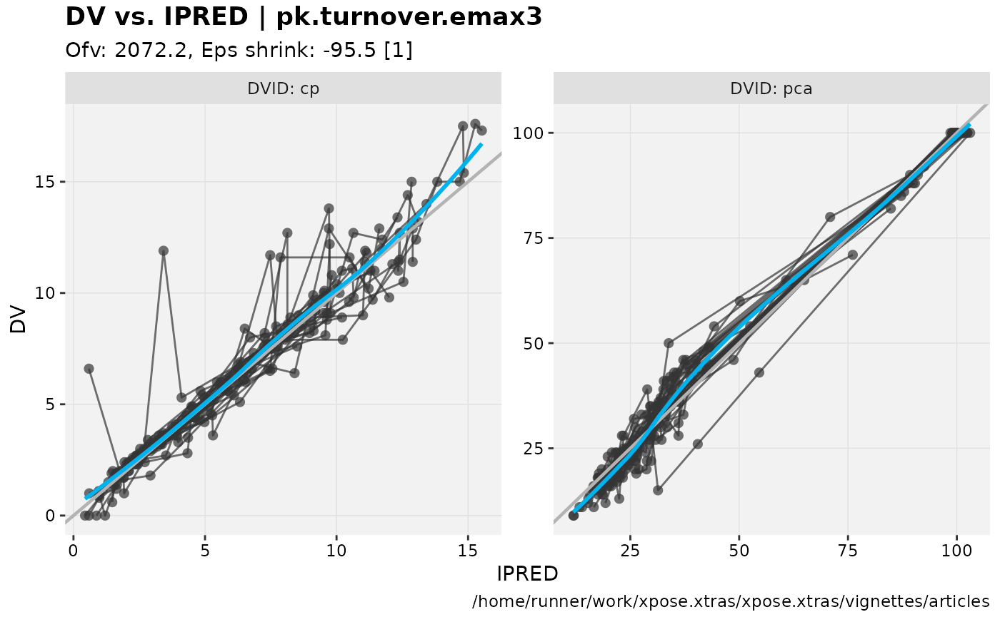
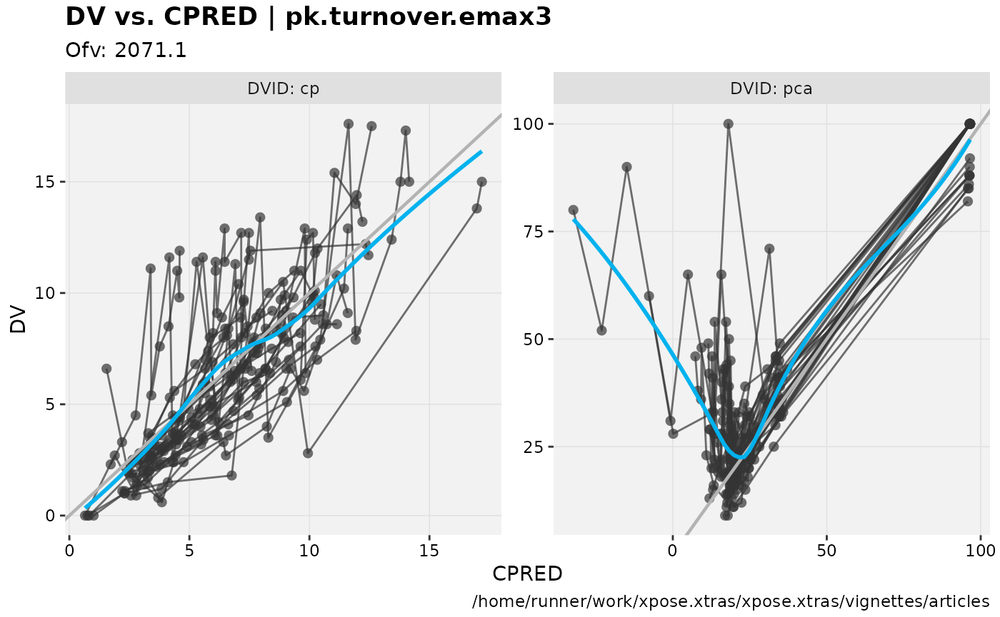
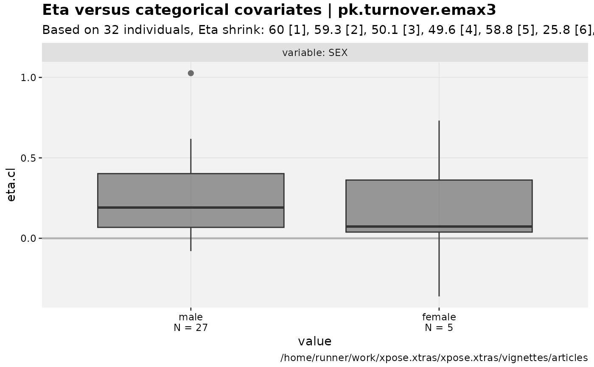
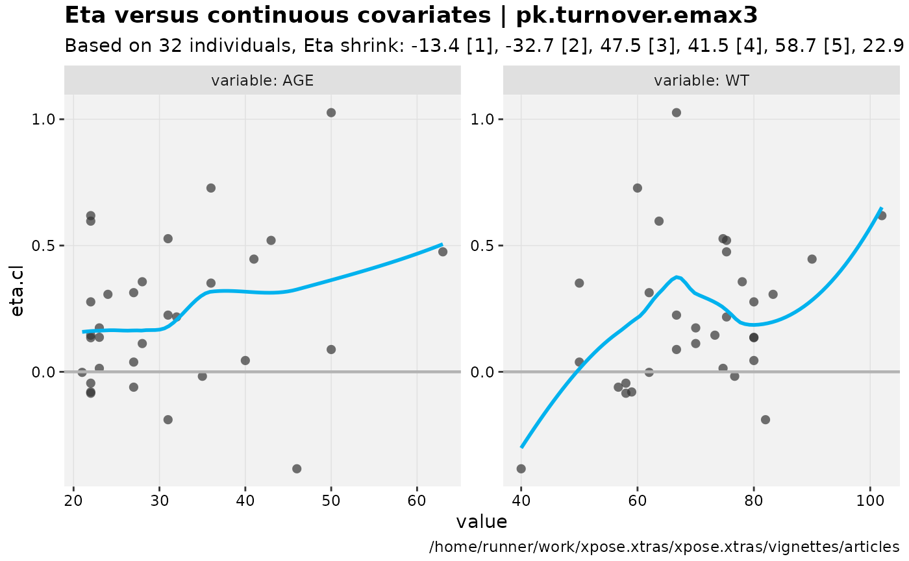
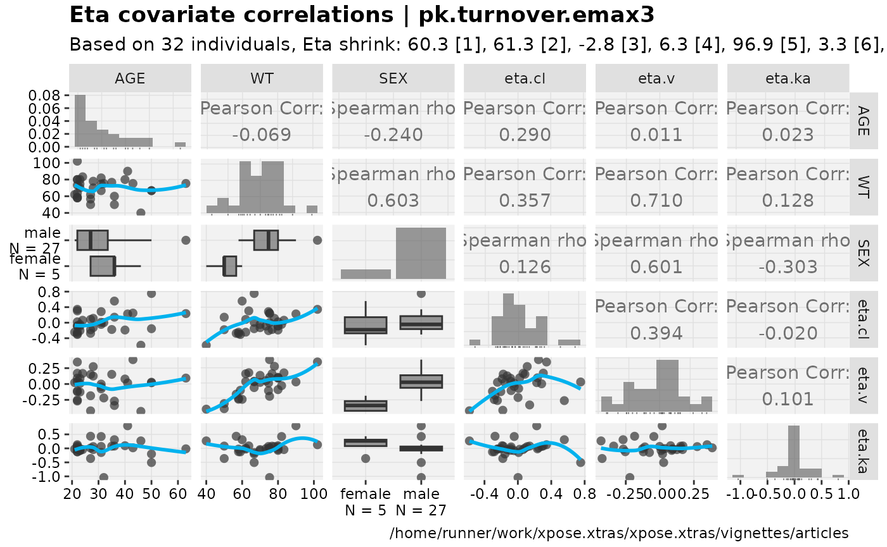
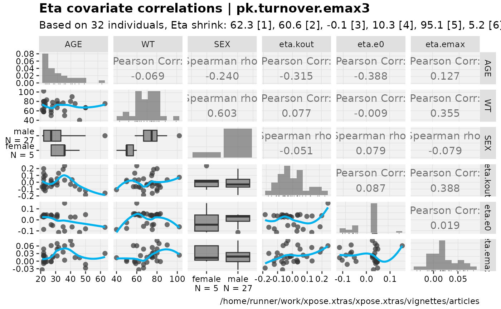
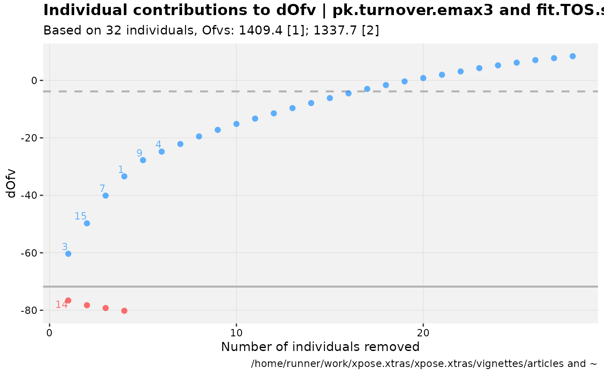
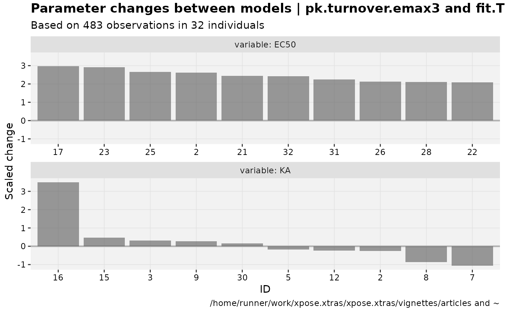
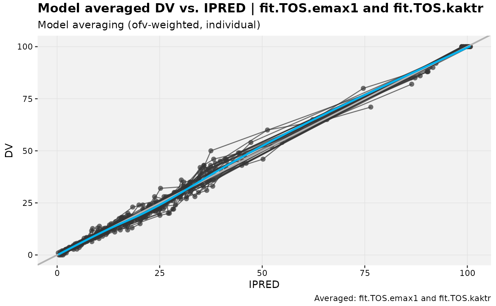

# nlmixr2 Support

``` r

library(nlmixr2)
library(xpose)
library(xpose.xtras)
set.seed(42^2)
```

`nlmixr2` fits are fully supported in the current release, including
many convenience functions to ensure consumed `nlmixr2` results are
fully compatible with most all available features of `xpose` and
`xpose.xtras`.

## Basics

While the `xpose.xtras` package already contains a few `nlmixr2`
examples, let’s start fresh with a new fit. The model below is from [the
`nlmixr2`
documentation](https://nlmixr2.org/articles/multiple-endpoints.html); to
start using the resulting `xpose_data` directly, refer to
`?nlmixr2_warfarin`.

``` r

pk.turnover.emax3 <- function() {
  ini({
    tktr <- log(1)
    tka <- log(1)
    tcl <- log(0.1)
    tv <- log(10)
    ##
    eta.ktr ~ 1
    eta.ka ~ 1
    eta.cl ~ 2
    eta.v ~ 1
    prop.err <- 0.1
    pkadd.err <- 0.1
    ##
    temax <- logit(0.8)
    tec50 <- log(0.5)
    tkout <- log(0.05)
    te0 <- log(100)
    ##
    eta.emax ~ .5
    eta.ec50  ~ .5
    eta.kout ~ .5
    eta.e0 ~ .5
    ##
    pdadd.err <- 10
  })
  model({
    ktr <- exp(tktr + eta.ktr)
    ka <- exp(tka + eta.ka)
    cl <- exp(tcl + eta.cl)
    v <- exp(tv + eta.v)
    emax = expit(temax+eta.emax)
    ec50 =  exp(tec50 + eta.ec50)
    kout = exp(tkout + eta.kout)
    e0 = exp(te0 + eta.e0)
    ##
    DCP = center/v
    PD=1-emax*DCP/(ec50+DCP)
    ##
    effect(0) = e0
    kin = e0*kout
    ##
    d/dt(depot) = -ktr * depot
    d/dt(gut) =  ktr * depot -ka * gut
    d/dt(center) =  ka * gut - cl / v * center
    d/dt(effect) = kin*PD -kout*effect
    ##
    cp = center / v
    cp ~ prop(prop.err) + add(pkadd.err)
    effect ~ add(pdadd.err) | pca
  })
}
fit.TOS <- nlmixr2(pk.turnover.emax3, warfarin, "focei", control=list(print=0),
                  table=list(cwres=TRUE, npde=TRUE))
#> [====|====|====|====|====|====|====|====|====|====] 0:00:00
#> [====|====|====|====|====|====|====|====|====|====] 0:00:00
#> [====|====|====|====|====|====|====|====|====|====] 0:00:00
#> [====|====|====|====|====|====|====|====|====|====] 0:00:00
#> [====|====|====|====|====|====|====|====|====|====] 0:00:00 
#> 
#> [====|====|====|====|====|====|====|====|====|====] 0:00:00 
#> 
#> [====|====|====|====|====|====|====|====|====|====] 0:00:00 
#> 
#> [====|====|====|====|====|====|====|====|====|====] 0:00:00 
#> 
#> [====|====|====|====|====|====|====|====|====|====] 0:00:00 
#> 
#> [====|====|====|====|====|====|====|====|====|====] 0:00:00 
#> 
#> [====|====|====|====|====|====|====|====|====|====] 0:00:00 
#> 
#> [====|====|====|====|====|====|====|====|====|====] 0:00:00
#> [====|====|====|====|====|====|====|====|====|====] 0:00:00 
#> 
#> [====|====|====|====|====|====|====|====|====|====] 0:00:00 
#> 
#> [====|====|====|====|====|====|====|====|====|====] 0:00:00 
#> 
#> [====|====|====|====|====|====|====|====|====|====] 0:00:00
#> [====|====|====|====|====|====|====|====|====|====] 0:00:00
#> [====|====|====|====|====|====|====|====|====|====] 0:00:00
#> calculating covariance matrix
#> [====|====|====|====|====|====|====|====|====|====] 0:00:22 
#> done
```

Now that we have a fit, we have a few options to consume the results
into `xpose`. We could use
[`xpose.nlmixr2::xpose_data_nlmixr2`](https://rdrr.io/pkg/xpose.nlmixr2/man/xpose_data_nlmixr2.html)
and then convert to an `xp_xtras` object from there.

``` r

xpose.nlmixr2::xpose_data_nlmixr2(fit.TOS) %>%
  as_xp_xtras()
#> 
#> ── ~ xp_xtras object 
#> Model description: not implemented
#> fit.TOS overview: 
#>  - Software: nlmixr2 7.0.2 
#>  - Attached files (memory usage 585.9 Kb): 
#>    + obs tabs: $prob no.1: nlmixr2 
#>    + sim tabs: <none> 
#>    + output files: obj 
#>    + special: <none> 
#>    + fit: <none>
#>  - gg_theme: :: xpose theme_readable 
#>  - xp_theme: xp_xtra_theme new_x$xp_theme 
#>  - Options: dir = NULL, quiet = TRUE, manual_import = NULL, cvtype = exact
```

It is helpful though, for traceability and for some convenience
functions for the fit object to be attached to the `xpose_data` object.

``` r

xpose.nlmixr2::xpose_data_nlmixr2(fit.TOS) %>%
  as_xp_xtras() %>%
  attach_nlmixr2(fit.TOS)
#> 
#> ── ~ xp_xtras object 
#> Model description: not implemented
#> fit.TOS overview: 
#>  - Software: nlmixr2 7.0.2 
#>  - Attached files (memory usage 757.9 Kb): 
#>    + obs tabs: $prob no.1: nlmixr2 
#>    + sim tabs: <none> 
#>    + output files: obj 
#>    + special: <none> 
#>    + fit: attached as (this)$fit
#>  - gg_theme: :: xpose theme_readable 
#>  - xp_theme: xp_xtra_theme new_x$xp_theme 
#>  - Options: dir = NULL, quiet = TRUE, manual_import = NULL, cvtype = exact
```

One such convenience function is to backfill some of the `"na"`
properties pulled from the fit results (at time of writing, these are
condition number and significant digits). It’s acknowledged that these
backfills are opinionated, hence it is optional.

``` r

xpose.nlmixr2::xpose_data_nlmixr2(fit.TOS) %>%
  as_xp_xtras() %>%
  attach_nlmixr2(fit.TOS) %>%
  backfill_nlmixr2_props() %>%
  {print(get_prop(., "condn")); .} %>%
  get_prop("nsig")
#> [1] "977.642642713977"
#> [1] "3"
```

A more useful application of the attached fit result is a method to make
[`get_prm()`](https://jprybylski.github.io/xpose.xtras/reference/get_prm.md)
work. Note,
[`xpose::prm_table()`](https://uupharmacometrics.github.io/xpose/reference/prm_table.html)
does not work despite this new feature because it uses the original
[`get_prm()`](https://jprybylski.github.io/xpose.xtras/reference/get_prm.md)
defined within `xpose` namespace. Since
[`prm_table()`](https://uupharmacometrics.github.io/xpose/reference/prm_table.html)
is a quick check convenience function to print in place,
[`get_prm()`](https://jprybylski.github.io/xpose.xtras/reference/get_prm.md)
was considered a better function to get working.

``` r

try({
xpose.nlmixr2::xpose_data_nlmixr2(fit.TOS) %>%
    as_xp_xtras() %>% xpose::get_prm()
})
#> Error in dplyr::mutate(., prm_names = purrr::map(.x = as.list(.$problem),  : 
#>   ℹ In argument: `prm_names = purrr::map(...)`.
#> Caused by error in `purrr::map()`:
#> ℹ In index: 1.
#> Caused by error in `UseMethod()`:
#> ! no applicable method for 'filter' applied to an object of class "NULL"
xpose.nlmixr2::xpose_data_nlmixr2(fit.TOS) %>%
  as_xp_xtras() %>%
  attach_nlmixr2(fit.TOS) %>%
  get_prm() %>%
  # Remove some columns for readability
  dplyr::select(-c(fixed,diagonal,label))
#> # A tibble: 20 × 9
#>    type  name         value        se       rse     m     n      cv     shk
#>    <chr> <chr>      <num:3>   <num:3>   <num:3> <int> <int> <num:3> <num:3>
#>  1 the   tktr        0.0246  0.000615  0.0250       1    NA    NA      NA  
#>  2 the   tka         0.0245  0.000821  0.0335       2    NA    NA      NA  
#>  3 the   tcl        -2.24    0.000973  0.000434     3    NA    NA      NA  
#>  4 the   tv          2.22    0.000607  0.000274     4    NA    NA      NA  
#>  5 the   prop.err    0.123   0.000376  0.00305      5    NA    NA      NA  
#>  6 the   pkadd.err   0.168   0.000744  0.00442      6    NA    NA      NA  
#>  7 the   temax       1.98    0.00111   0.000560     7    NA    NA      NA  
#>  8 the   tec50      -0.676   0.000677  0.00100      8    NA    NA      NA  
#>  9 the   tkout      -2.79    0.00112   0.000402     9    NA    NA      NA  
#> 10 the   te0         4.57    0.00125   0.000273    10    NA    NA      NA  
#> 11 the   pdadd.err   6.07    0.00248   0.000407    11    NA    NA      NA  
#> 12 ome   eta.ktr     0.945  NA        NA            1     1   120.     64  
#> 13 ome   eta.ka      0.945  NA        NA            2     2   120.     64  
#> 14 ome   eta.cl      0.567  NA        NA            3     3    61.6    50.1
#> 15 ome   eta.v       0.487  NA        NA            4     4    51.7    50.1
#> 16 ome   eta.emax    0.606  NA        NA            5     5    66.7    68.3
#> 17 ome   eta.ec50    0.632  NA        NA            6     6    70.1    25.7
#> 18 ome   eta.kout    0.513  NA        NA            7     7    54.9    71.4
#> 19 ome   eta.e0      0.384  NA        NA            8     8    39.9    81.6
#> 20 sig   sigma(1,1)  1      NA        NA            1     1    NA      11.8
```

To build on this, because `nlmixr2` coerces users to use mu-referencing
and captures parameter associations automatically, another useful
backfill includes mapping these parameter associations with
[`add_prm_association()`](https://jprybylski.github.io/xpose.xtras/reference/add_prm_association.md),
by way of
[`nlmixr2_prm_associations()`](https://jprybylski.github.io/xpose.xtras/reference/nlmixr2_prm_associations.md).
In this model, `temax` is logit transformed, so to keep assumptions
valid in the CV% calculation it needs to be back-transformed (as
indicated in a `cli` message).

``` r

xpose.nlmixr2::xpose_data_nlmixr2(fit.TOS) %>%
  as_xp_xtras() %>%
  attach_nlmixr2(fit.TOS) %>%
  nlmixr2_prm_associations() %>%
  mutate_prm(temax ~ plogis) %>%
  get_prm() %>%
  # Remove some columns for readability
  dplyr::select(-c(fixed,diagonal,label))
#> # A tibble: 20 × 9
#>    type  name         value        se       rse     m     n      cv     shk
#>    <chr> <chr>      <num:3>   <num:3>   <num:3> <int> <int> <num:3> <num:3>
#>  1 the   tktr        0.0246  0.000615  0.0250       1    NA   NA       NA  
#>  2 the   tka         0.0245  0.000821  0.0335       2    NA   NA       NA  
#>  3 the   tcl        -2.24    0.000973  0.000434     3    NA   NA       NA  
#>  4 the   tv          2.22    0.000607  0.000274     4    NA   NA       NA  
#>  5 the   prop.err    0.123   0.000376  0.00305      5    NA   NA       NA  
#>  6 the   pkadd.err   0.168   0.000744  0.00442      6    NA   NA       NA  
#>  7 the   temax       0.879   0.000118  0.000134     7    NA   NA       NA  
#>  8 the   tec50      -0.676   0.000677  0.00100      8    NA   NA       NA  
#>  9 the   tkout      -2.79    0.00112   0.000402     9    NA   NA       NA  
#> 10 the   te0         4.57    0.00125   0.000273    10    NA   NA       NA  
#> 11 the   pdadd.err   6.07    0.00248   0.000407    11    NA   NA       NA  
#> 12 ome   eta.ktr     0.945  NA        NA            1     1  120.      64  
#> 13 ome   eta.ka      0.945  NA        NA            2     2  120.      64  
#> 14 ome   eta.cl      0.567  NA        NA            3     3   61.6     50.1
#> 15 ome   eta.v       0.487  NA        NA            4     4   51.7     50.1
#> 16 ome   eta.emax    0.606  NA        NA            5     5    8.20    68.3
#> 17 ome   eta.ec50    0.632  NA        NA            6     6   70.1     25.7
#> 18 ome   eta.kout    0.513  NA        NA            7     7   54.9     71.4
#> 19 ome   eta.e0      0.384  NA        NA            8     8   39.9     81.6
#> 20 sig   sigma(1,1)  1      NA        NA            1     1   NA       11.8
#> # Parameter table includes the following associations: tktr~log(eta.ktr),
#> tka~log(eta.ka), tcl~log(eta.cl), tv~log(eta.v), temax~logit(eta.emax),
#> tec50~log(eta.ec50), tkout~log(eta.kout), and te0~log(eta.e0)
```

That’s a lot of boilerplate to pipe through, so a convenience function
has been developed to cover all of that. Note the parameter associations
are mapped automatically, but we could skip that step if we weren’t
planning to use
[`get_prm()`](https://jprybylski.github.io/xpose.xtras/reference/get_prm.md)
at all by setting `.skip_assoc=TRUE`.

``` r

nlmixr2_warfarin <- nlmixr2_as_xtra(fit.TOS)
```

## General Usage

We covered most of the usage unique to this package in the Basics
section, but this section is to illustrate that common functions will
continue to work. At time of writing, some missing properties are
present and should be added with a
[PR](https://github.com/nlmixr2/xpose.nlmixr2/pull/5) to `xpose.nlmixr2`
(these are not backfill candidates since they don’t exist in the summary
element, violating how
[`set_prop()`](https://jprybylski.github.io/xpose.xtras/reference/set_prop.md)
was designed to work).

``` r

list_vars(nlmixr2_warfarin)
#> List of available variables for problem no. 1
#>  - Subject identifier (id)               : ID
#>  - Dependent variable (dv)               : DV
#>  - Independent variable (idv)            : TIME
#>  - DV identifier (dvid)                  : DVID [0]
#>  - Dose amount (amt)                     : AMT
#>  - Event identifier (evid)               : EVID
#>  - Model typical predictions (pred)      : CPRED
#>  - Model individual predictions (ipred)  : IPRED
#>  - Model parameter (param)               : KA, CL, V
#>  - Eta (eta)                             : eta.ktr, eta.ka, eta.cl, eta.v, eta.emax, eta.ec50, eta.kout, eta.e0
#>  - Residuals (res)                       : NPDE, RES, WRES, IRES, IWRES, CRES, CWRES
#>  - Categorical covariates (catcov)       : SEX [0]
#>  - Continuous covariates (contcov)       : WT, AGE
#>  - Not attributed (na)                   : NLMIXRLLIKOBS, CMT, EPRED, ERES, NPD, PDE, PD, PRED, ETA.KTR, ETA.KA, ETA.CL, ETA.V, ETA.EMAX, ETA.EC50, ETA.KOUT, ETA.E0, DEPOT, GUT, CENTER, EFFECT, KTR, EMAX, EC50, KOUT, E0, DCP, PD.1, KIN, TAD, DOSENUM

dv_vs_ipred(nlmixr2_warfarin, facet="DVID")
#> `geom_smooth()` using formula = 'y ~ x'
```



``` r


dv_vs_pred(nlmixr2_warfarin, facet="DVID")
#> `geom_smooth()` using formula = 'y ~ x'
```



``` r


eta_vs_catcov(nlmixr2_warfarin, etavar = eta.cl)
```



``` r

eta_vs_contcov(nlmixr2_warfarin, etavar = eta.cl)
#> `geom_smooth()` using formula = 'y ~ x'
```



``` r


eta_vs_cov_grid(nlmixr2_warfarin, etavar = c(eta.cl,eta.v,eta.ka), quiet=TRUE)
```



``` r


eta_vs_cov_grid(nlmixr2_warfarin, etavar = c(eta.kout,eta.e0,eta.emax), quiet=TRUE)
```



## Sets

A simple change to the warfarin PK model is to use the same parameters
for `ka` and `ktr`. In the PD model, we could also fix `emax` to `1`
(and drop the interindividual variability). An analyst would explore
these separately and then maybe combine them, as we have done below.

``` r

fit.TOS.kaktr <- fit.TOS %>%
  model({
    ka <- ktr
  }) %>%
  nlmixr2(warfarin, "focei",
    control = list(print = 0),
    table = list(cwres = TRUE, npde = TRUE)
  )
#> [====|====|====|====|====|====|====|====|====|====] 0:00:00
#> [====|====|====|====|====|====|====|====|====|====] 0:00:00
#> [====|====|====|====|====|====|====|====|====|====] 0:00:00
#> [====|====|====|====|====|====|====|====|====|====] 0:00:00
#> [====|====|====|====|====|====|====|====|====|====] 0:00:00 
#> 
#> [====|====|====|====|====|====|====|====|====|====] 0:00:00 
#> 
#> [====|====|====|====|====|====|====|====|====|====] 0:00:00 
#> 
#> [====|====|====|====|====|====|====|====|====|====] 0:00:00 
#> 
#> [====|====|====|====|====|====|====|====|====|====] 0:00:00 
#> 
#> [====|====|====|====|====|====|====|====|====|====] 0:00:00 
#> 
#> [====|====|====|====|====|====|====|====|====|====] 0:00:00 
#> 
#> [====|====|====|====|====|====|====|====|====|====] 0:00:00
#> [====|====|====|====|====|====|====|====|====|====] 0:00:00 
#> 
#> [====|====|====|====|====|====|====|====|====|====] 0:00:00 
#> 
#> [====|====|====|====|====|====|====|====|====|====] 0:00:00 
#> 
#> [====|====|====|====|====|====|====|====|====|====] 0:00:00
#> [====|====|====|====|====|====|====|====|====|====] 0:00:00
#> [====|====|====|====|====|====|====|====|====|====] 0:00:00
#> calculating covariance matrix
#> [====|====|====|====|====|====|====|====|====|====] 0:00:21 
#> done

fit.TOS.emax1 <- fit.TOS %>%
  model({
    emax = 1
  }) %>%
  nlmixr2(warfarin, "focei",
    control = list(print = 0),
    table = list(cwres = TRUE, npde = TRUE)
  )
#> [====|====|====|====|====|====|====|====|====|====] 0:00:00
#> [====|====|====|====|====|====|====|====|====|====] 0:00:00
#> [====|====|====|====|====|====|====|====|====|====] 0:00:00
#> [====|====|====|====|====|====|====|====|====|====] 0:00:00
#> [====|====|====|====|====|====|====|====|====|====] 0:00:00 
#> 
#> [====|====|====|====|====|====|====|====|====|====] 0:00:00 
#> 
#> [====|====|====|====|====|====|====|====|====|====] 0:00:00 
#> 
#> [====|====|====|====|====|====|====|====|====|====] 0:00:00 
#> 
#> [====|====|====|====|====|====|====|====|====|====] 0:00:00 
#> 
#> [====|====|====|====|====|====|====|====|====|====] 0:00:00 
#> 
#> [====|====|====|====|====|====|====|====|====|====] 0:00:00 
#> 
#> [====|====|====|====|====|====|====|====|====|====] 0:00:00
#> [====|====|====|====|====|====|====|====|====|====] 0:00:00 
#> 
#> [====|====|====|====|====|====|====|====|====|====] 0:00:00 
#> 
#> [====|====|====|====|====|====|====|====|====|====] 0:00:00 
#> 
#> [====|====|====|====|====|====|====|====|====|====] 0:00:00
#> [====|====|====|====|====|====|====|====|====|====] 0:00:00
#> [====|====|====|====|====|====|====|====|====|====] 0:00:00
#> calculating covariance matrix
#> [====|====|====|====|====|====|====|====|====|====] 0:00:25 
#> done

fit.TOS.simple <- fit.TOS %>%
  model({
    ka <- ktr
    emax = 1
  }) %>%
  nlmixr2(warfarin, "focei",
    control = list(print = 0),
    table = list(cwres = TRUE, npde = TRUE)
  )
#> [====|====|====|====|====|====|====|====|====|====] 0:00:00
#> [====|====|====|====|====|====|====|====|====|====] 0:00:00
#> [====|====|====|====|====|====|====|====|====|====] 0:00:00
#> [====|====|====|====|====|====|====|====|====|====] 0:00:00
#> [====|====|====|====|====|====|====|====|====|====] 0:00:00 
#> 
#> [====|====|====|====|====|====|====|====|====|====] 0:00:00 
#> 
#> [====|====|====|====|====|====|====|====|====|====] 0:00:00 
#> 
#> [====|====|====|====|====|====|====|====|====|====] 0:00:00 
#> 
#> [====|====|====|====|====|====|====|====|====|====] 0:00:00 
#> 
#> [====|====|====|====|====|====|====|====|====|====] 0:00:00 
#> 
#> [====|====|====|====|====|====|====|====|====|====] 0:00:00 
#> 
#> [====|====|====|====|====|====|====|====|====|====] 0:00:00
#> [====|====|====|====|====|====|====|====|====|====] 0:00:00
#> [====|====|====|====|====|====|====|====|====|====] 0:00:00
#> [====|====|====|====|====|====|====|====|====|====] 0:00:00
#> [====|====|====|====|====|====|====|====|====|====] 0:00:00
#> calculating covariance matrix
#> [====|====|====|====|====|====|====|====|====|====] 0:00:15 
#> done
```

These explorations make up a set which can be examined with an
`xpose_set`:

``` r

# Since these models were created with piping, need to update their labels
warf_ka <- nlmixr2_as_xtra(fit.TOS.kaktr) %>%
  set_prop(run="fit.TOS.kaktr") %>%
  # Just to remove github action path
  set_option(
    dir = paste0("~")
  ) %>%
  set_prop(
    dir = paste0("~")
  )
warf_emax <- nlmixr2_as_xtra(fit.TOS.emax1) %>%
  set_prop(run="fit.TOS.emax1") %>%
  set_option(
    dir = paste0("~")
  ) %>%
  set_prop(
    dir = paste0("~")
  )
warf_simple <- nlmixr2_as_xtra(fit.TOS.simple) %>%
  set_prop(run="fit.TOS.simple") %>%
  set_option(
    dir = paste0("~")
  ) %>%
  set_prop(
    dir = paste0("~")
  )

warfarin_set <- xpose_set(
  nlmixr2_warfarin, warf_ka, warf_emax, warf_simple,
  .relationships = c(
    warf_ka~nlmixr2_warfarin,
    warf_emax~nlmixr2_warfarin,
    warf_simple ~ warf_ka + warf_emax
  )
) %>%
  # Add iOFVs
  focus_qapply(backfill_iofv)

warfarin_set
#> 
#> ── xpose_set object ────────────────────────────────────────────────────────────
#> • Number of models: 4
#> • Model labels: nlmixr2_warfarin, warf_ka, warf_emax, and warf_simple
#> • Number of relationships: 4
#> • Focused xpdb objects: none
#> • Exposed properties: none
#> • Base model: none

warfarin_set$warf_simple
#> 
#> ── Part of an xpose_set, with label: warf_simple ───────────────────────────────
#> • Parent(s): warf_ka and warf_emax
#> • In focus?: no
#> • Base model?: no
#> 
#> ── xpdb object (accessible with {xpose_set}$warf_simple$xpdb): 
#> 
#> ── ~ xp_xtras object 
#> Model description: not implemented
#> fit.TOS.simple overview: 
#>  - Software: nlmixr2 7.0.2 
#>  - Attached files (memory usage 750.6 Kb): 
#>    + obs tabs: $prob no.1 (modified): na, nlmixr2 
#>    + sim tabs: <none> 
#>    + output files: fit.TOS.simple 
#>    + special: <none> 
#>    + fit: attached as (this)$fit
#>  - gg_theme: :: xpose theme_readable 
#>  - xp_theme: xp_xtra_theme new_x$xp_theme 
#>  - Options: dir = ~, quiet = TRUE, manual_import = NULL, cvtype = exact

warfarin_set %>%
  expose_property(ofv) %>%
  expose_property(condn) %>%
  reshape_set() %>%
  # Remove some columns for readability
  dplyr::select(-c(parent,base,focus))
#> # A tibble: 4 × 4
#>   xpdb         label            ..ofv ..condn
#>   <named list> <chr>            <dbl>   <dbl>
#> 1 <xp_xtras>   nlmixr2_warfarin 1876.    978.
#> 2 <xp_xtras>   warf_ka          1328  102123.
#> 3 <xp_xtras>   warf_emax        1329.   3686.
#> 4 <xp_xtras>   warf_simple      1331.   1497.

warfarin_set %>%
  dofv_vs_id(nlmixr2_warfarin, warf_simple, .inorder = TRUE, df=1)
#> Warning: Removed 32 rows containing missing values or values outside the scale range
#> (`geom_hline()`).
#> Warning: Removed 29 rows containing missing values or values outside the scale range
#> (`geom_point()`).
#> Warning: Removed 1 row containing missing values or values outside the scale range
#> (`geom_point()`).
#> Warning: Removed 6 rows containing missing values or values outside the scale range
#> (`geom_text()`).
```



``` r


warfarin_set %>%
  # This comparison should be more interesting
  focus_qapply(set_var_types, param=c(KA,EC50), na=c(CL, V)) %>%
  prm_waterfall(nlmixr2_warfarin, warf_simple)
```



``` r


warfarin_set %>%
  dv_vs_ipred_modavg(warf_emax, warf_ka)
#> `geom_smooth()` using formula = 'y ~ x'
```



## Derived parameter explorations

The suggestion to have `nlmixr2` installed enables `rxode2` utility
functions to be leveraged for diagnostics (and probably many other
unrealized benefits, possibly using `nonmem2rx`). One of those features
is exploring the derived parameters for a model.

Now any model (it does not have to be fit with `nlmixr2`) can have
derived parameters calculated and checked for signs of misspecification.
The
[`derive_prm()`](https://jprybylski.github.io/xpose.xtras/reference/derive_prm.md)
family of functions can be used to generate a table of derived
parameters or to set derived parameters as `param` type variables.

``` r

nlmixr2_m3 <- nlmixr_example("nlmixr2_m3")
#> ℹ parameter labels from comments are typically ignored in non-interactive mode
#> ℹ Need to run with the source intact to parse comments
#> → loading into symengine environment...
#> → pruning branches (`if`/`else`) of full model...
#> ✔ done
#> [====|====|====|====|====|====|====|====|====|====] 0:00:00
#> → calculate sensitivities
#> [====|====|====|====|====|====|====|====|====|====] 0:00:00
#> → calculate ∂(f)/∂(η)
#> [====|====|====|====|====|====|====|====|====|====] 0:00:00
#> → calculate ∂(R²)/∂(η)
#> [====|====|====|====|====|====|====|====|====|====] 0:00:00
#> → finding duplicate expressions in inner model...
#> [====|====|====|====|====|====|====|====|====|====] 0:00:00
#> → optimizing duplicate expressions in inner model...
#> [====|====|====|====|====|====|====|====|====|====] 0:00:00 
#> 
#> [====|====|====|====|====|====|====|====|====|====] 0:00:00 
#> 
#> [====|====|====|====|====|====|====|====|====|====] 0:00:00
#> → finding duplicate expressions in EBE model...
#> [====|====|====|====|====|====|====|====|====|====] 0:00:00
#> → optimizing duplicate expressions in EBE model...
#> [====|====|====|====|====|====|====|====|====|====] 0:00:00
#> → compiling inner model...
#> ✔ done
#> → finding duplicate expressions in FD model...
#> [====|====|====|====|====|====|====|====|====|====] 0:00:00
#> → optimizing duplicate expressions in FD model...
#> [====|====|====|====|====|====|====|====|====|====] 0:00:00
#> → compiling EBE model...
#> ✔ done
#> → compiling events FD model...
#> ✔ done
#> calculating covariance matrix
#> done
#> → Calculating residuals/tables
#> ✔ done
```

``` r

nlmixr2_m3 %>%
  backfill_derived() %>%
  list_vars()
#> List of available variables for problem no. 1
#>  - Subject identifier (id)               : ID
#>  - Dependent variable (dv)               : DV
#>  - Independent variable (idv)            : TIME
#>  - Dose amount (amt)                     : AMT
#>  - Event identifier (evid)               : EVID
#>  - Model typical predictions (pred)      : CPRED
#>  - Model individual predictions (ipred)  : IPRED
#>  - Model parameter (param)               : KA, CL, V, VC, KEL, VSS, T12ALPHA, ALPHA, A, FRACA
#>  - Eta (eta)                             : eta.ka, eta.cl, eta.v
#>  - Residuals (res)                       : RES, WRES, IRES, IWRES, CRES, CWRES
#>  - Continuous covariates (contcov)       : WT
#>  - Not attributed (na)                   : CMT, CENS, LLOQ, NLMIXRLLIKOBS, PRED, LOWERLIM, UPPERLIM, ETA.KA, ETA.CL, ETA.V, DEPOT, CENT, BLQLIKE, TAD, DOSENUM

derive_prm(nlmixr2_m3) %>%
  dplyr::select(ID,KA,CL,VSS:(dplyr::last_col())) %>%
  head()
#>   ID        KA       CL      VSS  T12ALPHA      ALPHA          A FRACA
#> 1  1 1.7302305 1.721599 29.02450 11.685795 0.05931537 0.03445365     1
#> 2 10 0.7760401 1.873474 27.00237  9.990327 0.06938183 0.03703379     1
#> 3 11 3.2090732 3.800005 35.61656  6.496706 0.10669209 0.02807683     1
#> 4 12 0.9613681 2.416604 26.26258  7.532813 0.09201704 0.03807700     1
#> 5  2 1.8915689 3.265349 31.51171  6.689101 0.10362336 0.03173424     1
#> 6  3 2.2150171 2.936924 32.90564  7.766103 0.08925290 0.03038993     1


# If param has no vars, .prm should be set
pheno_base %>%
  backfill_derived(
    .prm = c(CL,V)
  ) %>%
  list_vars()
#> List of available variables for problem no. 1
#>  - Subject identifier (id)               : ID
#>  - Dependent variable (dv)               : DV
#>  - Independent variable (idv)            : TIME
#>  - Dose amount (amt)                     : AMT
#>  - Event identifier (evid)               : EVID
#>  - Missing dependent variable (mdv)      : MDV
#>  - Model typical predictions (pred)      : PRED
#>  - Model individual predictions (ipred)  : IPRED
#>  - Model parameter (param)               : CL, V, VC, KEL, VSS, T12ALPHA, ALPHA, A, FRACA
#>  - Eta (eta)                             : ETA1, ETA2
#>  - Residuals (res)                       : IWRES, CWRES, NPDE, RES, WRES
#>  - Categorical covariates (catcov)       : APGR ('Apgar score') [10]
#>  - Continuous covariates (contcov)       : WT ('Weight', kg)
#>  - Not attributed (na)                   : IRES, CRES
```

These derived parameters can be fed into
[`diagnose_constants()`](https://jprybylski.github.io/xpose.xtras/reference/diagnose_constants.md)
to perform some quick checks for common issues. In this case, we have
both `VC` (derived) and `V` (fitted) representing the same quantity, so
to avoid catching both in the volume check (which per the documentation
should only be one volume) the `vol_pattern` has been updated.

``` r

nlmixr2_m3 %>%
  backfill_derived() %>%
  diagnose_constants(vol_pattern = "^V$")
#> ℹ Checking for absorption flip-flop (first-order absorption slower than derived rate constants)...
#> ✔ No parameter sets are suggestive of flip-flop.
#> ℹ Checking for negative microconstants or volume...
#> ✔ No parameter sets have negative microconstants or volumes.

nlmixr2_m3 %>%
  backfill_derived() %>%
  diagnose_constants(
    vol_pattern = "^V$",
    df_units = list(KA = "1/hr", ALPHA = "1/hr"),
    checks = list(neg_microvol = FALSE)
  )
#> ℹ Checking for absorption flip-flop (first-order absorption slower than derived rate constants)...
#> ✔ No parameter sets are suggestive of flip-flop.
#> ℹ Checking that compared units match...
#> ✔ All relevant units seem to match.

# Using df form
derive_prm(nlmixr2_m3) %>%
  diagnose_constants(df = ., vol_pattern = "^V$")
#> ℹ Checking for absorption flip-flop (first-order absorption slower than derived rate constants)...
#> ✔ No parameter sets are suggestive of flip-flop.
#> ℹ Checking for negative microconstants or volume...
#> ✔ No parameter sets have negative microconstants or volumes.
```

## Session info

``` r

sessionInfo()
#> R version 4.6.1 (2026-06-24)
#> Platform: x86_64-pc-linux-gnu
#> Running under: Ubuntu 24.04.4 LTS
#> 
#> Matrix products: default
#> BLAS:   /usr/lib/x86_64-linux-gnu/openblas-pthread/libblas.so.3 
#> LAPACK: /usr/lib/x86_64-linux-gnu/openblas-pthread/libopenblasp-r0.3.26.so;  LAPACK version 3.12.0
#> 
#> locale:
#>  [1] LC_CTYPE=C.UTF-8       LC_NUMERIC=C           LC_TIME=C.UTF-8       
#>  [4] LC_COLLATE=C.UTF-8     LC_MONETARY=C.UTF-8    LC_MESSAGES=C.UTF-8   
#>  [7] LC_PAPER=C.UTF-8       LC_NAME=C              LC_ADDRESS=C          
#> [10] LC_TELEPHONE=C         LC_MEASUREMENT=C.UTF-8 LC_IDENTIFICATION=C   
#> 
#> time zone: UTC
#> tzcode source: system (glibc)
#> 
#> attached base packages:
#> [1] stats     graphics  grDevices utils     datasets  methods   base     
#> 
#> other attached packages:
#>  [1] xpose.xtras_0.2.2   xpose.nlmixr2_0.4.2 xpose_0.4.23       
#>  [4] ggplot2_4.0.3       rxode2_5.1.6        nlmixr2plot_5.1.0  
#>  [7] nlmixr2extra_5.2.0  nlmixr2est_7.0.2    nlmixr2save_0.2.0  
#> [10] nlmixr2data_2.0.10  lotri_1.0.4         nlmixr2_7.0.1      
#> 
#> loaded via a namespace (and not attached):
#>  [1] tidyselect_1.2.1   dplyr_1.2.1        farver_2.1.2       S7_0.2.2          
#>  [5] fastmap_1.2.0      GGally_2.4.0       tweenr_2.0.3       rex_1.2.2         
#>  [9] digest_0.6.39      lifecycle_1.0.5    magrittr_2.0.5     dparser_1.3.1-13  
#> [13] compiler_4.6.1     rlang_1.3.0        sass_0.4.10        tools_4.6.1       
#> [17] utf8_1.2.6         yaml_2.3.12        data.table_1.18.4  symengine_0.2.13  
#> [21] knitr_1.51         lbfgsb3c_2024-3.5  labeling_0.4.3     htmlwidgets_1.6.4 
#> [25] pmxcv_0.0.2        RColorBrewer_1.1-3 withr_3.0.3        purrr_1.2.2       
#> [29] sys_3.4.3          desc_1.4.3         grid_4.6.1         polyclip_1.10-7   
#> [33] scales_1.4.0       MASS_7.3-65        cli_3.6.6          rmarkdown_2.31    
#> [37] crayon_1.5.3       ragg_1.5.2         generics_0.1.4     otel_0.2.0        
#> [41] RcppParallel_6.2.0 rstudioapi_0.19.0  tzdb_0.5.0         minqa_1.2.8       
#> [45] cachem_1.1.0       ggforce_0.5.0      stringr_1.6.0      splines_4.6.1     
#> [49] vctrs_0.7.3        Matrix_1.7-5       jsonlite_2.0.0     PreciseSums_0.7   
#> [53] hms_1.1.4          systemfonts_1.3.2  tidyr_1.3.2        jquerylib_0.1.4   
#> [57] rxode2ll_2.0.16    glue_1.8.1         pkgdown_2.2.1      ggstats_0.13.0    
#> [61] codetools_0.2-20   stringi_1.8.9      gtable_0.3.6       tibble_3.3.1      
#> [65] pillar_1.11.1      clisymbols_1.2.0   htmltools_0.5.9    R6_2.6.1          
#> [69] textshaping_1.0.5  evaluate_1.0.5     lattice_0.22-9     readr_2.2.0       
#> [73] backports_1.5.1    vpc_1.2.4          nanonext_1.10.2    memoise_2.0.1     
#> [77] mirai_2.7.2        n1qn1_6.0.1-14     bslib_0.12.0       Rcpp_1.1.2        
#> [81] nlme_3.1-169       checkmate_2.3.4    mgcv_1.9-4         xfun_0.60         
#> [85] fs_2.1.0           forcats_1.0.1      pkgconfig_2.0.3
```
