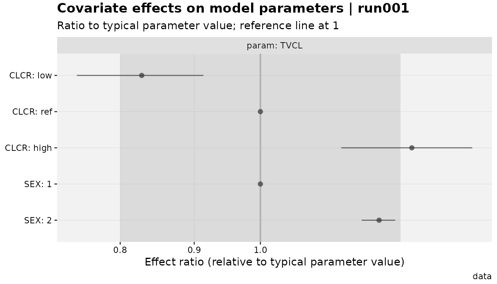
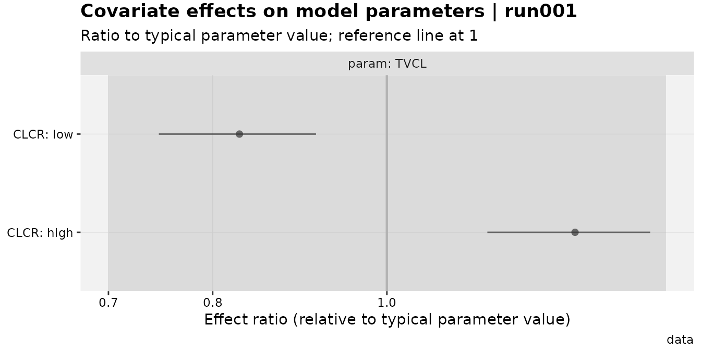
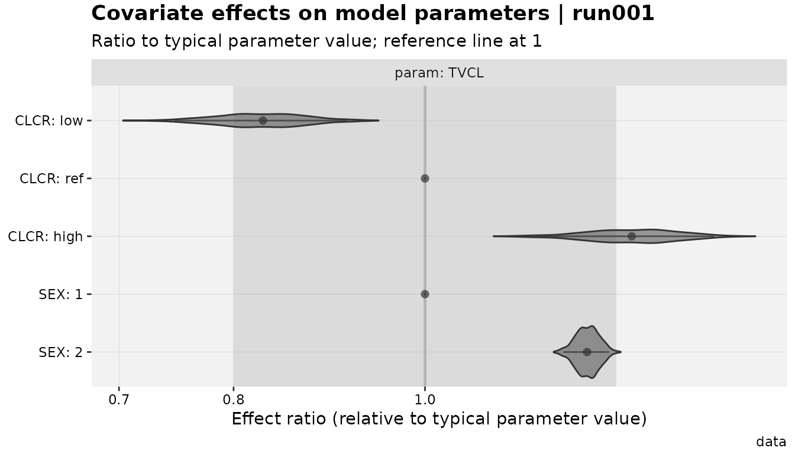

# Parameter Associations: Omega CVs and Covariate Effects

``` r

library(dplyr)
library(xpose)
library(xpose.xtras)
```

## Why declare anything at all?

A fitted NONMEM (or `nlmixr2`) model doesn’t carry an explicit record of
*why* a `THETA` is where it is. `xpose` can read the numbers back out,
but it has no way to know that `OMEGA(3,3)` is log-normal on `CL`, or
that `THETA(7)` is an allometric exponent on `CLCR`, rather than
something else entirely. Most of the time that doesn’t matter –
[`get_prm()`](https://jprybylski.github.io/xpose.xtras/reference/get_prm.md)
already assumes log-normal, which covers the common case – but the
moment a model deviates from that (a logit-transformed variability term,
a Box-Cox covariate effect, a piecewise “hockey-stick” model), `xpose`
has nothing to fall back on.

`xpose.xtras` gives you a way to say the quiet part out loud, once, and
have it flow through into reporting:

- \[[`add_prm_association()`](https://jprybylski.github.io/xpose.xtras/reference/add_prm_association.md)\]
  links a structural parameter to the **omega** driving its
  between-subject variability, so
  \[[`get_prm()`](https://jprybylski.github.io/xpose.xtras/reference/get_prm.md)\]
  can report a meaningful CV% even when the relationship isn’t plain
  log-normal.
- \[[`add_cov_association()`](https://jprybylski.github.io/xpose.xtras/reference/add_cov_association.md)\]
  links a structural parameter to a **covariate**, so
  \[[`prm_cov()`](https://jprybylski.github.io/xpose.xtras/reference/prm_cov.md)\]/\[[`cov_forest()`](https://jprybylski.github.io/xpose.xtras/reference/cov_forest.md)\]
  can report and plot the covariate’s effect as a ratio to the
  parameter’s typical value.

The two are deliberately parallel: the same formula-based declaration
style (`LHS ~ fun(...)`), the same two-stage validate-then-store
behavior, and the same “redeclare to replace” semantics. This article
covers both, plus
\[[`mutate_prm()`](https://jprybylski.github.io/xpose.xtras/reference/mutate_prm.md)\],
the escape hatch for when a parameter isn’t on the scale either
mechanism assumes.

## Omega associations and CV%

By default,
\[[`get_prm()`](https://jprybylski.github.io/xpose.xtras/reference/get_prm.md)\]
treats every diagonal omega as log-normal and reports CV% accordingly:

``` r

pheno_base %>%
  get_prm(quiet = TRUE) %>%
  select(type, name, label, value, cv)
#> # A tibble: 8 × 5
#>   type  name       label      value      cv
#>   <chr> <chr>      <chr>    <num:3> <num:3>
#> 1 the   THETA1     "CL"      0.0068    NA  
#> 2 the   THETA2     "V"       1.4       NA  
#> 3 the   THETA3     "RUVADD"  2.86      NA  
#> 4 the   THETA4     "RUVPRO"  0         NA  
#> 5 ome   OMEGA(1,1) "IIVCL"   0.489     52.0
#> 6 ome   OMEGA(2,1) ""        0.998     NA  
#> 7 ome   OMEGA(2,2) "IIVV"    0.393     40.9
#> 8 sig   SIGMA(1,1) ""        1         NA
```

`IIVCL` and `IIVV` get a `cv` column; the off-diagonal and fixed-effect
rows don’t (CV% is only defined for a diagonal random effect acting on a
specific structural parameter). This is already the CV% you’d get by
hand from a log-normal assumption –
[`add_prm_association()`](https://jprybylski.github.io/xpose.xtras/reference/add_prm_association.md)
becomes useful the moment that assumption is wrong for a given
parameter.

Say `CL` was actually fit as logit-normal instead (purely for
illustration – it wasn’t, in this model). Declaring that changes only
the `cv` column; nothing else about the fit or the table shape changes:

``` r

pheno_base %>%
  add_prm_association(CL ~ logit(IIVCL)) %>%
  get_prm(quiet = TRUE) %>%
  select(type, name, label, value, cv)
#> # A tibble: 8 × 5
#>   type  name       label      value      cv
#>   <chr> <chr>      <chr>    <num:3> <num:3>
#> 1 the   THETA1     "CL"      0.0068    NA  
#> 2 the   THETA2     "V"       1.4       NA  
#> 3 the   THETA3     "RUVADD"  2.86      NA  
#> 4 the   THETA4     "RUVPRO"  0         NA  
#> 5 ome   OMEGA(1,1) "IIVCL"   0.489     51.3
#> 6 ome   OMEGA(2,1) ""        0.998     NA  
#> 7 ome   OMEGA(2,2) "IIVV"    0.393     40.9
#> 8 sig   SIGMA(1,1) ""        1         NA
#> # Parameter table includes the following associations:
#> CL~logit(IIVCL)
```

Built-in distributions cover the common cases: `log` (the default, made
explicit), `logexp` (`log(1+X)`), `logit`, `arcsin`, and `nmboxcox`
(Box-Cox, needs a `lambda`):

``` r

pheno_base %>%
  add_prm_association(V ~ nmboxcox(IIVV, lambda = 0.5)) %>%
  get_prm(quiet = TRUE) %>%
  select(name, label, value, cv)
#> # A tibble: 8 × 4
#>   name       label      value      cv
#>   <chr>      <chr>    <num:3> <num:3>
#> 1 THETA1     "CL"      0.0068    NA  
#> 2 THETA2     "V"       1.4       NA  
#> 3 THETA3     "RUVADD"  2.86      NA  
#> 4 THETA4     "RUVPRO"  0         NA  
#> 5 OMEGA(1,1) "IIVCL"   0.489     52.0
#> 6 OMEGA(2,1) ""        0.998     NA  
#> 7 OMEGA(2,2) "IIVV"    0.393     38.3
#> 8 SIGMA(1,1) ""        1         NA
#> # Parameter table includes the following associations:
#> V~nmboxcox(IIVV)
```

For anything else, `custom()` takes a `qdist`/`pdist` pair (the
transform and its inverse):

``` r

pheno_base %>%
  add_prm_association(V ~ custom(IIVV, qdist = function(x) log(0.001 + x), pdist = function(x) exp(x) - 0.001)) %>%
  get_prm(quiet = TRUE) %>%
  select(name, label, value, cv)
#> # A tibble: 8 × 4
#>   name       label      value      cv
#>   <chr>      <chr>    <num:3> <num:3>
#> 1 THETA1     "CL"      0.0068    NA  
#> 2 THETA2     "V"       1.4       NA  
#> 3 THETA3     "RUVADD"  2.86      NA  
#> 4 THETA4     "RUVPRO"  0         NA  
#> 5 OMEGA(1,1) "IIVCL"   0.489     52.0
#> 6 OMEGA(2,1) ""        0.998     NA  
#> 7 OMEGA(2,2) "IIVV"    0.393     41.0
#> 8 SIGMA(1,1) ""        1         NA
#> # Parameter table includes the following associations:
#> V~custom(IIVV)
```

Redeclaring an association for the same parameter replaces it;
[`drop_prm_association()`](https://jprybylski.github.io/xpose.xtras/reference/add_prm_association.md)
removes it entirely (falling back to the log-normal default):

``` r

pheno_base %>%
  add_prm_association(CL ~ logit(IIVCL)) %>%
  drop_prm_association(CL) %>%
  get_prm(quiet = TRUE) %>%
  select(name, label, value, cv)
#> # A tibble: 8 × 4
#>   name       label      value      cv
#>   <chr>      <chr>    <num:3> <num:3>
#> 1 THETA1     "CL"      0.0068    NA  
#> 2 THETA2     "V"       1.4       NA  
#> 3 THETA3     "RUVADD"  2.86      NA  
#> 4 THETA4     "RUVPRO"  0         NA  
#> 5 OMEGA(1,1) "IIVCL"   0.489     52.0
#> 6 OMEGA(2,1) ""        0.998     NA  
#> 7 OMEGA(2,2) "IIVV"    0.393     40.9
#> 8 SIGMA(1,1) ""        1         NA
```

**One important caveat**: the CV% calculation assumes the *fixed-effect*
value is on its natural, untransformed scale. If `CL` were actually
fitted on the logit scale itself (not just related to a logit-normal
omega), the reported `value` would need converting back first – see
[Rescaling with `mutate_prm()`](#rescaling-with-mutate_prm) below.

## Covariate associations and forest plots

The same idea, for covariates instead of omegas. `xpdb_x` already has a
real covariate effect in it – `THETA7`, labeled “CRCL on CL”:

``` r

xpdb_x %>%
  get_prm(.problem = 1, quiet = TRUE) %>%
  select(type, name, label, value, se)
#> # A tibble: 11 × 5
#>    type  name       label           value       se
#>    <chr> <chr>      <chr>         <num:3>  <num:3>
#>  1 the   THETA1     "TVCL"       26.3      0.891  
#>  2 the   THETA2     "TVV"         1.35     0.0438 
#>  3 the   THETA3     "TVKA"        4.2      0.809  
#>  4 the   THETA4     "LAG"         0.208    0.0157 
#>  5 the   THETA5     "Prop. Err"   0.205    0.0224 
#>  6 the   THETA6     "Add. Err"    0.0106   0.00366
#>  7 the   THETA7     "CRCL on CL"  0.00717  0.0017 
#>  8 ome   OMEGA(1,1) "IIV CL"      0.27     0.0233 
#>  9 ome   OMEGA(2,2) "IIV V"       0.195    0.032  
#> 10 ome   OMEGA(3,3) "IIV KA"      1.38     0.202  
#> 11 sig   SIGMA(1,1) ""            1       NA
```

[`add_cov_association()`](https://jprybylski.github.io/xpose.xtras/reference/add_cov_association.md)
describes how a covariate affects a structural parameter, as a ratio to
that parameter’s typical value (always `1` at a declared reference
value/level):

``` r

xpdb_x %>%
  add_cov_association(TVCL ~ linear(CLCR, THETA7, ref = 64)) %>%
  prm_cov()
#> # A tibble: 3 × 10
#>   param covariate covtype level value is_ref effect ci_low ci_high ci_method 
#>   <chr> <chr>     <chr>   <chr> <chr> <lgl>   <dbl>  <dbl>   <dbl> <chr>     
#> 1 TVCL  CLCR      cont    low   40    FALSE   0.828  0.747   0.913 simulation
#> 2 TVCL  CLCR      cont    ref   64    TRUE    1      1       1     simulation
#> 3 TVCL  CLCR      cont    high  102   FALSE   1.27   1.14    1.40  simulation
#> # `effect` is a ratio to the parameter's typical value (1 at the reference
#> covariate value/level); CI via simulation.
```

`ref` is **always required, explicitly** – there’s no way to infer it
safely, since NONMEM control streams often normalize a covariate against
a hardcoded constant that isn’t visible from the `xpdb` alone.

### Built-in forms

Six built-ins cover the usual covariate models, all constructed so the
effect ratio is exactly `1` at `ref` regardless of the theta value:

``` r

# power (allometric): (COV/ref)^theta
xpdb_x %>% add_cov_association(TVCL ~ power(CLCR, THETA7, ref = 64)) %>% prm_contcov()
#> # A tibble: 3 × 10
#>   param covariate covtype level value is_ref effect ci_low ci_high ci_method 
#> * <chr> <chr>     <chr>   <chr> <chr> <lgl>   <dbl>  <dbl>   <dbl> <chr>     
#> 1 TVCL  CLCR      cont    low   40    FALSE   0.997  0.995   0.998 simulation
#> 2 TVCL  CLCR      cont    ref   64    TRUE    1      1       1     simulation
#> 3 TVCL  CLCR      cont    high  102   FALSE   1.00   1.00    1.00  simulation
#> # `effect` is a ratio to the parameter's typical value (1 at the reference
#> covariate value/level); CI via simulation.

# exponential: exp(theta*(COV-ref))
xpdb_x %>% add_cov_association(TVCL ~ exponential(CLCR, THETA7, ref = 64)) %>% prm_contcov()
#> # A tibble: 3 × 10
#>   param covariate covtype level value is_ref effect ci_low ci_high ci_method 
#> * <chr> <chr>     <chr>   <chr> <chr> <lgl>   <dbl>  <dbl>   <dbl> <chr>     
#> 1 TVCL  CLCR      cont    low   40    FALSE   0.842  0.776   0.917 simulation
#> 2 TVCL  CLCR      cont    ref   64    TRUE    1      1       1     simulation
#> 3 TVCL  CLCR      cont    high  102   FALSE   1.31   1.15    1.49  simulation
#> # `effect` is a ratio to the parameter's typical value (1 at the reference
#> covariate value/level); CI via simulation.

# additive: (theta+COV)/(theta+ref) -- an uncommon but simple par = theta + cov model
xpdb_x %>% add_cov_association(TVCL ~ additive(CLCR, THETA7, ref = 64)) %>% prm_contcov()
#> # A tibble: 3 × 10
#>   param covariate covtype level value is_ref effect ci_low ci_high ci_method 
#> * <chr> <chr>     <chr>   <chr> <chr> <lgl>   <dbl>  <dbl>   <dbl> <chr>     
#> 1 TVCL  CLCR      cont    low   40    FALSE   0.625  0.625   0.625 simulation
#> 2 TVCL  CLCR      cont    ref   64    TRUE    1      1       1     simulation
#> 3 TVCL  CLCR      cont    high  102   FALSE   1.59   1.59    1.59  simulation
#> # `effect` is a ratio to the parameter's typical value (1 at the reference
#> covariate value/level); CI via simulation.

# hockey-stick (PsN-style): different slope above/below ref (which doubles as the
# breakpoint by default; see `brk=` to separate them)
xpdb_x %>% add_cov_association(TVCL ~ hockey(CLCR, THETA7, THETA4, ref = 64)) %>% prm_contcov()
#> # A tibble: 3 × 10
#>   param covariate covtype level value is_ref effect ci_low ci_high ci_method 
#> * <chr> <chr>     <chr>   <chr> <chr> <lgl>   <dbl>  <dbl>   <dbl> <chr>     
#> 1 TVCL  CLCR      cont    low   40    FALSE   0.828  0.747   0.913 simulation
#> 2 TVCL  CLCR      cont    ref   64    TRUE    1      1       1     simulation
#> 3 TVCL  CLCR      cont    high  102   FALSE   8.90   7.68   10.1   simulation
#> # `effect` is a ratio to the parameter's typical value (1 at the reference
#> covariate value/level); CI via simulation.

# catshift: one theta per non-reference categorical level
xpdb_x %>% add_cov_association(TVCL ~ catshift(SEX, THETA4, ref = 1)) %>% prm_catcov()
#> # A tibble: 2 × 10
#>   param covariate covtype level value is_ref effect ci_low ci_high ci_method 
#> * <chr> <chr>     <chr>   <chr> <chr> <lgl>   <dbl>  <dbl>   <dbl> <chr>     
#> 1 TVCL  SEX       cat     1     1     TRUE     1      1       1    simulation
#> 2 TVCL  SEX       cat     2     2     FALSE    1.21   1.18    1.24 simulation
#> # `effect` is a ratio to the parameter's typical value (1 at the reference
#> covariate value/level); CI via simulation.
```

Note how differently `power` and `linear` read the *same* `THETA7`: a
power exponent of `0.007` barely moves the ratio across any realistic
`CLCR` range, while the same number as a linear slope gives a
substantial swing. **Picking the right built-in for how the covariate
actually enters the model matters** – the computation can’t tell the two
apart for you, and a mismatched builtin produces a numerically valid but
silently wrong ratio. When none of the built-ins fit, `custom()` takes a
`fun(cov, ref, theta)`, validated at declaration time to confirm
`fun(ref, ref, theta) == 1` for a few probe thetas:

``` r

xpdb_x %>%
  add_cov_association(
    TVCL ~ custom(CLCR, THETA7, ref = 64, fun = function(cov, ref, theta) (cov / ref)^theta)
  ) %>%
  prm_contcov()
#> # A tibble: 3 × 10
#>   param covariate covtype level value is_ref effect ci_low ci_high ci_method 
#> * <chr> <chr>     <chr>   <chr> <chr> <lgl>   <dbl>  <dbl>   <dbl> <chr>     
#> 1 TVCL  CLCR      cont    low   40    FALSE   0.997  0.995   0.998 simulation
#> 2 TVCL  CLCR      cont    ref   64    TRUE    1      1       1     simulation
#> 3 TVCL  CLCR      cont    high  102   FALSE   1.00   1.00    1.00  simulation
#> # `effect` is a ratio to the parameter's typical value (1 at the reference
#> covariate value/level); CI via simulation.
```

[`drop_cov_association()`](https://jprybylski.github.io/xpose.xtras/reference/add_cov_association.md)
removes a declared (parameter, covariate) pair, the same way
[`drop_prm_association()`](https://jprybylski.github.io/xpose.xtras/reference/add_prm_association.md)
works for omegas:

``` r

xpdb_x %>%
  add_cov_association(TVCL ~ linear(CLCR, THETA7, ref = 64)) %>%
  drop_cov_association(TVCL ~ CLCR) %>%
  prm_cov()
#> # A tibble: 0 × 10
#> # ℹ 10 variables: param <chr>, covariate <chr>, covtype <chr>, level <chr>,
#> #   value <chr>, is_ref <lgl>, effect <dbl>, ci_low <dbl>, ci_high <dbl>,
#> #   ci_method <chr>
```

### `prm_cov()` output

[`prm_contcov()`](https://jprybylski.github.io/xpose.xtras/reference/prm_cov.md)/[`prm_catcov()`](https://jprybylski.github.io/xpose.xtras/reference/prm_cov.md)/[`prm_cov()`](https://jprybylski.github.io/xpose.xtras/reference/prm_cov.md)
all return the same shape: one row per (parameter, covariate, evaluation
point), with `effect`/`ci_low`/`ci_high` as ratios to the typical value,
and an `is_ref` flag for the (uninformative, always-`1`) reference row:

``` r

xpdb_x %>%
  add_cov_association(
    TVCL ~ linear(CLCR, THETA7, ref = 64),
    TVCL ~ catshift(SEX, THETA4, ref = 1)
  ) %>%
  prm_cov()
#> # A tibble: 5 × 10
#>   param covariate covtype level value is_ref effect ci_low ci_high ci_method 
#>   <chr> <chr>     <chr>   <chr> <chr> <lgl>   <dbl>  <dbl>   <dbl> <chr>     
#> 1 TVCL  CLCR      cont    low   40    FALSE   0.828  0.747   0.913 simulation
#> 2 TVCL  CLCR      cont    ref   64    TRUE    1      1       1     simulation
#> 3 TVCL  CLCR      cont    high  102   FALSE   1.27   1.14    1.40  simulation
#> 4 TVCL  SEX       cat     1     1     TRUE    1      1       1     simulation
#> 5 TVCL  SEX       cat     2     2     FALSE   1.21   1.18    1.24  simulation
#> # `effect` is a ratio to the parameter's typical value (1 at the reference
#> covariate value/level); CI via simulation.
```

Continuous covariates are evaluated at the 5th/95th percentile of the
observed data (`probs=`) plus the reference; categorical covariates at
every observed level. The confidence interval comes from `ci_method`:
`"simulation"` (default) draws from `N(theta_hat, se)` and propagates
through the (possibly nonlinear) effect function; `"delta"` is a cheaper
first-order analytic approximation.

### Plotting: `cov_forest()`

``` r

xpdb_x %>%
  add_cov_association(
    TVCL ~ linear(CLCR, THETA7, ref = 64),
    TVCL ~ catshift(SEX, THETA4, ref = 1)
  ) %>%
  cov_forest()
#> Using data from $prob no.1
```



The default view includes a reference line at `1`, a shaded “no relevant
effect” band (`region=`, default `c(0.8, 1.25)`, a common
bioequivalence-style convention – override or drop it with `type=`), and
one row per evaluation point. `show_ref = FALSE` drops the uninformative
reference rows; `TVCL ~ CLCR` (or any `param ~ covariate` formula)
restricts which declared associations get plotted:

``` r

xpdb_x %>%
  add_cov_association(
    TVCL ~ linear(CLCR, THETA7, ref = 64),
    TVCL ~ catshift(SEX, THETA4, ref = 1)
  ) %>%
  cov_forest(TVCL ~ CLCR, show_ref = FALSE, region = c(0.7, 1.43))
#> Using data from $prob no.1
```



Including `"v"` in `type` adds a violin layer showing the actual
simulation draws behind each interval (requires
`ci_method = "simulation"`, the default):

``` r

xpdb_x %>%
  add_cov_association(
    TVCL ~ linear(CLCR, THETA7, ref = 64),
    TVCL ~ catshift(SEX, THETA4, ref = 1)
  ) %>%
  cov_forest(type = "pilrv")
#> Using data from $prob no.1
#> Re-fetching data for the violin layer (one row per draw, a different shape than
#> the point/interval data).
#> Using data from $prob no.1
```



[`cov_forest()`](https://jprybylski.github.io/xpose.xtras/reference/cov_forest.md)
is the covariate-specific wrapper around a generic, forest-plot-agnostic
renderer,
\[[`xplot_forest()`](https://jprybylski.github.io/xpose.xtras/reference/xplot_forest.md)\]
– the same split as
[`eta_vs_catcov()`](https://jprybylski.github.io/xpose.xtras/reference/eta_vs_catcov.md)/[`xplot_boxplot()`](https://jprybylski.github.io/xpose.xtras/reference/xplot_boxplot.md)
elsewhere in the package. Reaching for
[`xplot_forest()`](https://jprybylski.github.io/xpose.xtras/reference/xplot_forest.md)
directly is only useful when plotting something *other* than a
[`prm_cov()`](https://jprybylski.github.io/xpose.xtras/reference/prm_cov.md)
table.

## Rescaling with `mutate_prm()`

Both association mechanisms assume a specific scale:
[`add_prm_association()`](https://jprybylski.github.io/xpose.xtras/reference/add_prm_association.md)
assumes the fixed-effect value is untransformed (natural units, not
logit/log/whatever);
[`add_cov_association()`](https://jprybylski.github.io/xpose.xtras/reference/add_cov_association.md)
assumes the chosen builtin’s formula matches the model code, including
how the LHS parameter itself was parameterized – though notably, the
covariate computation *never touches the LHS’s own fitted value*, only
the covariate-effect theta, so it’s automatically agnostic to whether
the LHS was log- or identity-parameterized.

When a parameter genuinely needs converting first,
\[[`mutate_prm()`](https://jprybylski.github.io/xpose.xtras/reference/mutate_prm.md)\]
does that in place, updating both the value and (via simulation) its
standard error:

``` r

# Say THETA12 in vismo_pomod was fitted on the logit scale, and needs to be
# expressed on the natural (0-1) scale before an association is declared
vismo_pomod %>%
  mutate_prm(THETA12 ~ plogis) %>%
  get_prm(quiet = TRUE) %>%
  filter(name == "THETA12") %>%
  select(name, label, value, se)
#> Warning: [$prob no.1, subprob no.1, lce] $SIGMA labels did not match the number
#> of SIGMAs in the `.ext` file.
#> Warning: Shrinkage missing for sigma estimates, if any are modeled. Using NA in this
#> table.
#> # A tibble: 1 × 4
#>   name    label                                                    value      se
#>   <chr>   <chr>                                                   <num:> <num:3>
#> 1 THETA12 THETA(12) ; B1: baseline of LOGIT(P(AE>=1)); final est… 0.0157 0.00302
```

This is the same recommendation
\[[`add_prm_association()`](https://jprybylski.github.io/xpose.xtras/reference/add_prm_association.md)\]’s
own documentation already carries for the logit/Box-Cox omega case –
reach for
[`mutate_prm()`](https://jprybylski.github.io/xpose.xtras/reference/mutate_prm.md)
first, then declare the association on the now-natural-scale value.

## Session info

``` r

sessionInfo()
#> R version 4.6.1 (2026-06-24)
#> Platform: x86_64-pc-linux-gnu
#> Running under: Ubuntu 24.04.4 LTS
#> 
#> Matrix products: default
#> BLAS:   /usr/lib/x86_64-linux-gnu/openblas-pthread/libblas.so.3 
#> LAPACK: /usr/lib/x86_64-linux-gnu/openblas-pthread/libopenblasp-r0.3.26.so;  LAPACK version 3.12.0
#> 
#> locale:
#>  [1] LC_CTYPE=C.UTF-8       LC_NUMERIC=C           LC_TIME=C.UTF-8       
#>  [4] LC_COLLATE=C.UTF-8     LC_MONETARY=C.UTF-8    LC_MESSAGES=C.UTF-8   
#>  [7] LC_PAPER=C.UTF-8       LC_NAME=C              LC_ADDRESS=C          
#> [10] LC_TELEPHONE=C         LC_MEASUREMENT=C.UTF-8 LC_IDENTIFICATION=C   
#> 
#> time zone: UTC
#> tzcode source: system (glibc)
#> 
#> attached base packages:
#> [1] stats     graphics  grDevices utils     datasets  methods   base     
#> 
#> other attached packages:
#> [1] xpose.xtras_0.2.2 xpose_0.4.23      ggplot2_4.0.3     dplyr_1.2.1      
#> 
#> loaded via a namespace (and not attached):
#>  [1] utf8_1.2.6         sass_0.4.10        generics_0.1.4     tidyr_1.3.2       
#>  [5] stringi_1.8.9      hms_1.1.4          digest_0.6.39      magrittr_2.0.5    
#>  [9] evaluate_1.0.5     grid_4.6.1         RColorBrewer_1.1-3 fastmap_1.2.0     
#> [13] jsonlite_2.0.0     backports_1.5.1    purrr_1.2.2        scales_1.4.0      
#> [17] tweenr_2.0.3       textshaping_1.0.5  jquerylib_0.1.4    cli_3.6.6         
#> [21] rlang_1.3.0        polyclip_1.10-7    withr_3.0.3        cachem_1.1.0      
#> [25] yaml_2.3.12        otel_0.2.0         tools_4.6.1        tzdb_0.5.0        
#> [29] checkmate_2.3.4    forcats_1.0.1      vctrs_0.7.3        R6_2.6.1          
#> [33] lifecycle_1.0.5    stringr_1.6.0      fs_2.1.0           htmlwidgets_1.6.4 
#> [37] MASS_7.3-65        ragg_1.5.2         pkgconfig_2.0.3    desc_1.4.3        
#> [41] pkgdown_2.2.1      pillar_1.11.1      bslib_0.12.0       gtable_0.3.6      
#> [45] glue_1.8.1         pmxcv_0.0.2        ggforce_0.5.0      systemfonts_1.3.2 
#> [49] xfun_0.60          tibble_3.3.1       tidyselect_1.2.1   knitr_1.51        
#> [53] farver_2.1.2       htmltools_0.5.9    rmarkdown_2.31     readr_2.2.0       
#> [57] compiler_4.6.1     S7_0.2.2
```
